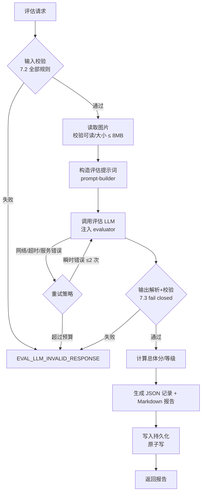

# PRD — 提示词优化效果评估系统（PromptEval，v1：图片）

> 版本：v2（2026-08-14）｜状态：已实现｜范围：图片 + 视频评估（视频生成：Agnes Video V2.0 异步抽帧）
> 分支：`codex/prompt-image-eval-system`

---

## 1. 背景与问题

当前 Story2Video / 通用 OPTIMIZE_BATCH 路径中，所有图片提示词统一经 prompt-engine（8013）优化后再生成图片（见 `openspec/specs/image-prompt-engine/spec.md`）。但**优化效果没有任何反馈闭环**：

- 不知道优化后的提示词生成出来的图片「像不像、对不对、好不好看」；
- 不知道问题出在**原文/上下文**还是**优化后的提示词**（无法定位归因）；
- 同一文案生成的多张连续图片（轮播/分镜）之间风格、角色、色调是否一致，没有量化手段；
- 没有数据积累，prompt-engine 的优化策略只能靠人工抽样，无法持续迭代。

## 2. 目标

建立一套「提示词优化效果评估体系」：

1. **打分**：对提示词优化引擎的输出（生成图片）按多维度量化打分（0-100）。
2. **归因分析**：分析有问题的方面，并区分问题来源于输入文案 / 上下文 / 优化后提示词 / 负向提示 / 生成模型。
3. **优化提示的点**：产出可直接回馈给【提示词优化引擎】的提示词优化建议（增加细节、消除歧义、强化风格、对齐上下文、补充负向提示、结构化、一致性锚点）。
4. **持续提升闭环**：评估记录持久化 → 聚合分析 → 形成优化点清单 → 指导 prompt-engine 的改写策略与模板迭代。
5. **扩展性**：v2 同时支持图片与视频评估；媒体类型抽象（mediaType）统一契约，视频经生成→抽帧（首/中/尾 3 帧）→同一评估 LLM 完成多维度评估（时序一致性、运动准确性等视频维度）。

## 3. 范围

### 3.1 本期范围（v1）

| 能力 | 说明 |
|------|------|
| 图片评估 | 对 1 张或多张（同文案）生成图片执行多维度评估 |
| 评估维度 | 关联度、内容准确性、视觉审美质量、跨图上下文一致性（≥2 张时参与） |
| 问题归因 | 问题分类 + 严重度 + 指向的提示词来源（原文/上下文/优化后提示词/负向提示） |
| 优化建议 | 提示词优化点（类型 + 目标 + 建议文案），供人工或 prompt-engine 消费 |
| 持久化 | 评估记录（JSON）、人读报告（Markdown）、索引（index.json） |
| 聚合分析 | 跨记录统计：维度均值、问题类别分布、优化点汇总 |
| 使用入口 | CLI 批处理 + 桌面应用 IPC + Vue 评估视图 |
| 视频评估 | mediaType=video：生成视频（Agnes Video V2.0 异步任务）→ 抽首/中/尾 3 帧 → 复用图片评估契约做视频维度评估（fail closed：密钥缺失/生成失败/抽帧失败均明确报错） |

### 3.2 不在本期范围

- 独立音轨评估（真实音频消费）实际实现（抽帧评估不消费音轨，音画同步以画面帧代理评估）；
- 自动把评估结果写回 prompt-engine 并自动改模板（本期只产出建议清单，人工/后续迭代消费）；
- 生成流程内的自动评估挂钩（本期为独立评估入口，输入为「生成图片 + 该图对应的输入文案/上下文/优化后提示词」）。

## 4. 评估维度与评分规则

### 4.1 维度定义（图片模式）

| id | 维度 | 权重 | 评估内容 |
|----|------|------|----------|
| `relevance` | 提示-输出关联度 | 0.30 | 生成图片与「原始文案 + 整个文案上下文 + 优化后的提示词」的整体语义关联程度；图片是否在讲同一个故事/表达同一主题 |
| `content_accuracy` | 内容准确性 | 0.30 | 关键元素是否准确呈现：主体、动作、场景、数量、风格、色彩、文字、道具、人物关系；是否存在幻觉元素或缺失 |
| `aesthetic_quality` | 视觉审美质量 | 0.20 | 构图、光影、色彩和谐、焦点/清晰度、细节质量、风格执行度（不评价主观喜好，只评价技法层面的完成度与一致性） |
| `cross_image_consistency` | 跨图上下文一致性 | 0.20 | 同一文案生成的多张连续图片之间：角色外观一致性、视觉风格一致性、色调/氛围连续性、场景衔接合理性（仅当图片数 ≥2 时参与计分） |

### 4.2 分数与等级

- 每个维度与总体分均为 **0-100 的整数**。
- 总体分 = 参与维度分数 × 权重的加权和（四舍五入到整数）。
- 单图评估（1 张）：`cross_image_consistency` 不参与，权重归一化为：关联度 0.375、内容准确性 0.375、视觉审美 0.25。
- 等级映射：

| 总体分 | 等级 | 含义 |
|--------|------|------|
| ≥85 | 优秀 | 与提示高度吻合，内容准确，审美在线 |
| 70-84 | 良好 | 基本吻合，有少量可优化点 |
| 50-69 | 一般 | 明显偏差或质量问题，需要优化提示词后重试 |
| <50 | 差 | 严重不吻合/不可用，建议大幅调整提示词 |

### 4.3 评分依据要求（对 LLM 评估器的约束）

每个维度必须给出：
- `score`：0-100 整数；
- `evidence`：非空字符串，说明图片中实际看到什么、与提示词的对应关系（只描述事实，不写空话）；
- `issues`：该维度发现的具体问题列表（可为空数组）；
- `suggestions`：针对该维度的改进建议列表（可为空数组）。

## 5. 问题分类与归因

### 5.1 问题类别（problem.category 白名单）

| id | 中文名 | 说明 |
|----|--------|------|
| `content_missing` | 关键元素缺失 | 提示中的主体/道具/场景没有出现 |
| `content_wrong` | 元素错误/幻觉 | 出现提示中没有的元素或主体属性错误（如性别/数量/动作错误） |
| `style_deviation` | 风格偏离 | 视觉风格与提示声明的风格不一致 |
| `layout_composition` | 构图问题 | 主体位置/比例/裁剪/空间关系不当 |
| `color_lighting` | 色彩/光影问题 | 色彩失真、曝光、阴影异常 |
| `text_rendering` | 文字渲染问题 | 图中文字乱码/错字/多余文字 |
| `ambiguity` | 提示词歧义 | 提示词本身表达含糊导致理解偏差（归因到提示词而非生成模型） |
| `context_loss` | 上下文丢失 | 图片与原文/整个文案上下文的背景设定不符（如时代/地域/角色设定错误） |
| `consistency_break` | 跨图一致性断裂 | 多张图之间角色/风格/色调不连续 |
| `quality_defect` | 图像质量缺陷 | 模糊、伪影、畸变、噪点、截断 |
| `unknown` | 其他 | 无法归类的问题（记录时归入 Info） |

### 5.2 问题来源归因（problem.promptPart 白名单）

| 值 | 含义 |
|----|------|
| `source_text` | 输入原文本身信息不足/有歧义 |
| `context` | 上下文（文案整体背景）未被利用或与场景冲突 |
| `optimized_prompt` | 优化后的提示词引入的问题（缺细节/歧义/冲突/风格弱化） |
| `negative_prompt` | 负向提示缺失或过强导致的问题 |
| `unknown` | 无法归因（如生成模型本身的能力限制） |

### 5.3 严重度

| 严重度 | 含义 | 后续动作 |
|--------|------|----------|
| `critical` | 图片不可用（内容完全错误/严重失真/一致性崩溃） | 必须调整提示词重新生成 |
| `major` | 明显缺陷但可接受（次要元素缺失/风格偏移） | 建议优化提示词后重试 |
| `minor` | 轻微瑕疵（构图/色彩微调） | 记录即可 |

## 6. 提示词优化点（可回馈提示词优化引擎）

评估报告的 `promptOptimizationPoints` 数组，每项含 `type`、`target`、`suggestion`（建议文案），类型白名单：

| id | 中文名 | 说明 | 典型建议示例 |
|----|--------|------|--------------|
| `add_specificity` | 补充明确细节 | 提示词缺少主体/动作/场景/数量的具体描述 | 「明确主体数量与动作：'一位穿红色唐装的老年女性在土灶前用柴火做饭'」 |
| `resolve_ambiguity` | 消除歧义 | 一词多义/可多解表达 | 「'老人'歧义：指定性别、年龄层、衣着」 |
| `enforce_style` | 强化风格约束 | 风格词过弱或被稀释 | 「前置风格锚点并在结尾重复：'写实电影感，柔光，浅景深'」 |
| `align_context` | 对齐文案上下文 | 与全文背景设定冲突 | 「结合全文时代设定：'唐代长安民居厨房，禁止现代元素'」 |
| `add_negative` | 补充负向提示 | 需要排除的元素未在负向提示声明 | 「负向提示增加：'现代电器、西式厨房、英文文字'」 |
| `structure_ordering` | 结构化/顺序化 | 提示词堆砌、主次不分 | 「按 主体→动作→场景→风格→镜头 顺序重排，用逗号分段」 |
| `consistency_anchor` | 一致性锚点 | 多图需要统一锚定 | 「为系列图加入统一锚点：'同一角色形象描述'、'统一暖色调'」 |

## 7. 输入与数据校验（fail closed）

### 7.1 评估请求（运行评估）

```jsonc
{
  "mediaType": "image",              // 必填，v1 仅支持 "image"
  "items": [                         // 必填，非空数组，同文案多图放同一批
    {
      "imagePath": "C:/.../scene-0.png",   // 必填：本地图片绝对路径
      "sourceText": "一个老妇人在做饭",      // 必填（与 context 至少一个）：该图的原始文案
      "context": { "synopsis": "..." },     // 可选：整个文案上下文（对象或字符串，字符串归一为 { synopsis }）
      "optimizedPrompt": "写实风格，一位中国唐代老妇人...", // 必填：prompt-engine 优化后的提示词
      "negativePrompt": "现代电器, 英文文字",   // 可选：负向提示
      "imageIndex": 0                       // 可选：跨图排序用；缺省按数组顺序
    }
  ],
  "options": {
    "language": "zh",                 // 可选：报告/提示词语言，默认 zh
    "temperature": 0,                 // 可选：评估 LLM 温度，默认 0
    "evaluatorModel": null            // 可选：指定评估模型，缺省由服务解析
  }
}
```

### 7.2 校验规则（任一失败 → 立即报错，不评估）

| 规则 | 校验 | 错误码 |
|------|------|--------|
| mediaType | `image` 或 `video`；图片模式 1-20 张，视频模式 1 个视频（≤50MB，抽 3 帧评估） | — |
| items 非空 | 数组且长度 ≥1 | `EVAL_EMPTY_ITEMS` |
| imagePath | 必须为字符串、非空、文件存在、是文件（非目录） | `EVAL_IMAGE_NOT_FOUND` |
| imagePath 边界 | 路径必须能被主进程读取（IPC 场景再做 canonical 校验，拒绝越界/不存在） | `EVAL_IMAGE_UNREADABLE` |
| imagePath 格式 | 扩展名白名单（png/jpg/jpeg/webp/gif/bmp）+ 文件头魔数校验（PNG/JPEG/WebP/GIF/BMP 签名），防伪图片/任意文件外带 | `EVAL_IMAGE_INVALID` |
| optimizedPrompt | 必须为非空字符串（长度 ≤ 5000，超长拒绝） | `EVAL_OPTIMIZED_PROMPT_INVALID` |
| sourceText | 长度 ≤ 20000，超长拒绝 | `EVAL_SOURCE_TOO_LONG` |
| context | 序列化后 ≤ 20000，超长拒绝 | `EVAL_CONTEXT_TOO_LONG` |
| negativePrompt | 长度 ≤ 5000，超长拒绝 | `EVAL_NEGATIVE_TOO_LONG` |
| sourceText/context | 至少一个非空；两者都为空 → 拒绝 | `EVAL_SOURCE_MISSING` |
| context 类型 | 字符串或纯对象；**递归**过滤敏感键（password/token/secret/api_key/credential/authorization/cookie 等，任意嵌套深度；顶层与嵌套命中均拒绝） | `EVAL_SENSITIVE_CONTEXT` |
| options.language | `zh` 或 `en`，其余拒绝 | `EVAL_LANGUAGE_INVALID` |
| options.temperature | 0-2 数字，越界收敛到 [0,2] | — |
| options.evaluatorModel | 字符串或 null | — |
| 图片总数 | ≤ 20（超出拒绝，防止单次评估超预算） | `EVAL_TOO_MANY_IMAGES` |

### 7.3 评估器输出校验（fail closed）

LLM 评估器返回的原始文本必须能解析为 JSON 且通过以下校验，否则整次评估失败（**不静默降级、不截断使用部分结果**），错误码 `EVAL_LLM_INVALID_RESPONSE`：

- `overall`：0-100 数字；
- `dimensions`：数组，每项 `{ id, score, evidence, issues, suggestions }`：
  - `id` ∈ 当前模式维度白名单，且无重复；
  - `score` 为 0-100 数字；
  - `evidence` 为非空字符串；
  - `issues` / `suggestions` 为字符串数组（缺省为空数组）；
  - 维度数量必须与参与维度一致（单图 3 个，多图 4 个）；
- `problems`：**必须存在且为数组**（缺失或非数组 → 整次失败）；每项 `{ severity, category, description, promptPart, suggestion }`：
  - `severity` ∈ {critical, major, minor}；
  - `category` ∈ 问题类别白名单（含 unknown）；
  - `description` 非空字符串；
  - `promptPart` ∈ 归因白名单；
- `promptOptimizationPoints`：**必须存在且为数组**（缺失或非数组 → 整次失败）；每项 `{ type, target, suggestion }`：
  - `type` ∈ 优化点类型白名单；
  - `suggestion` 非空字符串；
  - `target` 字符串（默认 `optimized_prompt`）。

校验通过后，系统按 4.2 重新计算总体分（以 `overall` 为准但做范围校验；若 LLM 给出的 `overall` 与加权计算偏差 >10 分，记录 `overallMismatch: true` 到报告并保留 LLM 值）。

## 8. 功能逻辑与流程

### 8.1 运行评估流程（单次）



### 8.2 跨图一致性逻辑

- 同一请求 `items.length ≥ 2` 时启用 `cross_image_consistency` 维度：把**全部图片 + 全部优化后提示词 + 原文/上下文**一次性交给评估 LLM，让其对比评估。
- `items.length === 1` 时该维度不参与，权重归一化（见 4.2）。
- 跨图评估的 LLM 输出仍走 7.3 同一契约（该维度 id 必须存在）。

### 8.3 聚合分析逻辑（analyze）

输入：一批评估记录（默认全部）。
输出：

```jsonc
{
  "recordCount": 12,
  "averageOverall": 78.5,
  "gradeDistribution": { "excellent": 3, "good": 6, "fair": 2, "poor": 1 },
  "dimensionAverages": [ { "id": "relevance", "average": 82.1 }, ... ],
  "problemCategories": [ { "category": "content_wrong", "count": 8, "severity": { "critical": 2, "major": 5, "minor": 1 } }, ... ],
  "promptPartDistribution": [ { "promptPart": "optimized_prompt", "count": 10 }, ... ],
  "optimizationPoints": [
    { "type": "add_specificity", "count": 5, "examples": ["...", "..."] },
    ...
  ],
  "recommendations": [ "按问题类别 Top3 输出可执行建议文本" ]
}
```

### 8.4 持续提升闭环

1. 每次评估产生 `promptOptimizationPoints`（针对该次优化后提示词的具体改法）；
2. `analyze` 聚合出高频问题类别与优化点类型；
3. 人工/后续迭代将高频优化点落入 prompt-engine 的改写模板（如 StyleType 检测、场景上下文注入、负向提示模板）；
4. 模板更新后用同批输入重跑评估，对比分数趋势（`recordCount` 增长后 `averageOverall` 是否上升）。

## 9. 交互逻辑（桌面应用 Vue 视图）

### 9.1 入口与页面

- 导航菜单新增「提示词评估」入口（图标 🧪），路由 `/prompt-eval`，页面 `PromptEvalView.vue`。
- 页面分 3 个 Tab：**运行评估** / **历史记录** / **聚合分析**。

### 9.2 运行评估 Tab

| 显示项 | 类型 | 说明 |
|--------|------|------|
| 图片列表 | 文件选择（支持多选）+ 缩略图列表 | 通过系统文件选择器选图；每张图可单独移除；显示文件名/大小 |
| 原始文案（sourceText） | 多行文本框 | 该文案对应原始输入文字（可多行） |
| 文案上下文（context） | 多行文本框 | 整个文案上下文；留空时只传 sourceText |
| 优化后的提示词（optimizedPrompt） | 多行文本框 | prompt-engine 输出的优化后提示词（必填） |
| 负向提示（negativePrompt） | 多行文本框 | 可选 |
| 评估模型 | 下拉 | 从已配置模型解析出的视觉评估模型（默认自动） |
| 运行按钮 | 主按钮「开始评估」 | 点击后先本地校验，再调 IPC `prompt-eval:run` |
| 运行状态 | 加载态/进度 | 评估中显示 spinner + 「评估中（1/3 张）...」式提示；不可重复提交 |
| 错误提示 | 错误横幅 | IPC 返回 EVAL_* 错误码时展示中文可读文案 |

### 9.3 评估结果展示（运行评估 Tab 结果区 / 详情）

| 显示项 | 说明 |
|--------|------|
| 总体分 | 大号分数 + 等级徽章（优秀/良好/一般/差） |
| 维度评分条 | 每个维度：名称、分数、进度条（颜色随等级）、evidence 摘要 |
| 图片缩略图 | 每张被评估图片（点击放大预览） |
| 问题列表 | 按严重度排序：🔴 critical / 🟠 major / 🟡 minor；每条显示 类别标签 + 描述 + 归因（原文/上下文/优化后提示词/负向提示）+ 建议 |
| 提示词优化点 | 卡片列表：类型标签 + 建议文案（可复制） |
| 输入快照 | 折叠面板，展示本次评估使用的原文/上下文/优化后提示词/负向提示（用于复现） |
| 操作 | 「复制 JSON」「打开 Markdown 报告」「再次评估」 |

### 9.4 历史记录 Tab

| 显示项 | 说明 |
|--------|------|
| 记录列表 | 时间、总体分、等级、图片数、维度摘要（横向 mini 条） |
| 筛选 | 按等级/日期筛选（v1 支持等级筛选） |
| 操作 | 查看详情（复用结果区）、删除记录（二次确认）、打开报告目录 |
| 空态 | 「暂无评估记录」+ 引导去运行评估 |

### 9.5 聚合分析 Tab

| 显示项 | 说明 |
|--------|------|
| 记录数/平均分 | 统计卡片 |
| 等级分布 | 条形图（优秀/良好/一般/差） |
| 维度均值 | 维度条形图 |
| 问题类别 Top | 按出现次数排序的问题类别分布 |
| 优化点汇总 | 高频优化点类型 + 示例建议（来自各记录 examples） |
| 推荐动作 | 基于 Top 问题类别的建议文本 |

### 9.6 文案（提示文字）

所有用户可见文案使用 `zh.js` i18n 键（`promptEval.*` 命名空间），关键文案如下：

- 页面标题：`提示词优化效果评估`
- 运行按钮：`开始评估`
- 维度名：关联度 / 内容准确性 / 视觉审美质量 / 跨图上下文一致性
- 等级：优秀 / 良好 / 一般 / 差
- 空输入提示：`请先选择至少 1 张图片，并填写优化后的提示词`
- 未配置评估模型：`未配置支持视觉评估的模型服务商，请先在「模型服务商」中配置并启用视觉模型`
- 视频密钥缺失：`未配置视频生成模型密钥（agnes-video），请在「模型密钥」中配置后重试`
- 评估中：`评估中（已完成 {done}/{total} 张）...`
- 失败：`评估失败：{message}`

## 10. 持久化设计

```
<userData>/prompt-eval/
├── index.json                 # 记录索引：[{ id, evaluatedAt, mediaType, overallScore, grade, imageCount }]
├── records/<id>.json          # 完整评估记录（输入快照 + 评估结果）
└── reports/<id>.md            # 人读 Markdown 报告
```

- `id`：`eval-<yyyyMMdd-HHmmss>-<8位随机>`（可排序、防碰撞）。
- 写入策略：临时文件 + `rename` 原子替换；Windows 对 `EPERM/EACCES/EBUSY` 做短且有界退避重试（≤3 次，间隔 50/100/200ms），其余错误原样抛出。
- `index.json` 与 `records/` 同事务语义：先写记录，再更新索引；索引更新失败时记录仍保留（下次 list 可扫描 records 目录修复索引）。
- 测试使用 `os.tmpdir()` 下带 PID/随机标识的独立目录，禁止写仓库固定路径。

## 11. 错误处理与错误码

| 错误码 | 触发场景 | 用户提示 |
|--------|----------|----------|
| `OPS_PROMPT_EVAL_VIDEO_KEY_MISSING` | 视频生成模型密钥未配置 | 未配置视频生成模型密钥，请在「模型密钥」中添加 |
| `EVAL_EMPTY_ITEMS` | items 为空 | 请至少提供 1 张图片 |
| `EVAL_IMAGE_NOT_FOUND` | 图片不存在/不可读 | 图片文件不存在或无法读取 |
| `EVAL_IMAGE_TOO_LARGE` | 单图 >8MB | 图片过大（>8MB），请压缩后重试 |
| `EVAL_OPTIMIZED_PROMPT_INVALID` | 优化后提示词为空/超长 | 优化后的提示词不能为空且不超过 5000 字 |
| `EVAL_SOURCE_MISSING` | 原文与上下文都为空 | 请填写原始文案或文案上下文 |
| `EVAL_SENSITIVE_CONTEXT` | 上下文含敏感键 | 上下文中不允许包含密钥等敏感字段 |
| `EVAL_LANGUAGE_INVALID` | language 非 zh/en | 不支持的语言 |
| `EVAL_TOO_MANY_IMAGES` | 图片 >20 | 单次最多评估 20 张图片 |
| `EVAL_LLM_INVALID_RESPONSE` | 评估器输出解析/校验失败 | 评估模型返回了无法解析的结果，请重试 |
| `EVAL_LLM_UNAVAILABLE` | 未配置评估模型或调用失败 | 未配置支持视觉评估的模型服务商 |
| `EVAL_IMAGE_INVALID` | 扩展名不在白名单或文件头魔数不符 | 图片格式不受支持或文件内容与扩展名不符 |
| `EVAL_SOURCE_TOO_LONG` / `EVAL_CONTEXT_TOO_LONG` / `EVAL_NEGATIVE_TOO_LONG` | 输入超长 | 输入内容超长，请精简后重试 |
| `EVAL_STORE_WRITE_FAILED` | 持久化写入/删除失败 | 评估结果保存失败 |
| `EVAL_INTERNAL` | 未归类内部错误 | 评估失败，请重试 |
| `EVAL_STORE_WRITE_FAILED` | 持久化写入失败 | 评估结果保存失败 |
| `EVAL_RECORD_NOT_FOUND` | 查询/删除不存在的记录 | 记录不存在 |

错误对象统一：`{ code, message, details? }`，IPC 抛出前包装为 Error（`error.code`）。

## 12. 提示文字：评估提示词（prompt-builder 全文）

> 该提示词是评估 LLM 的输入，v1 使用中文（language=zh 默认），输出要求 JSON。

```
【角色】你是专业的 AI 生成图像评估专家。你负责评估「提示词优化引擎」的输出效果：给定原始文案、整个文案上下文、优化后的提示词（以及负向提示）和生成的图片，你需要给出客观、严格、可复核的评估结果。

【任务】逐维度评估图片，并输出严格 JSON（不要输出任何 JSON 以外的文字，不要使用代码块包裹）。

【输入快照】
- 原始文案：{sourceText}
- 文案上下文：{contextJson}
- 优化后的提示词：{optimizedPrompt}
- 负向提示：{negativePrompt}
- 图片数：{count}
{imageListBlock}

【评分标准】（每个维度 0-100 整数）
1. relevance 提示-输出关联度（权重 30%）：图片与「原始文案+上下文+优化后提示词」整体语义的吻合程度。
2. content_accuracy 内容准确性（权重 30%）：关键元素（主体/动作/场景/数量/风格/色彩/文字/道具）是否准确呈现，是否出现幻觉或缺失。
3. aesthetic_quality 视觉审美质量（权重 20%）：构图、光影、色彩和谐、清晰度、细节质量、风格执行度。
{crossImageBlock}

【输出 JSON 契约】
{
  "overall": 0-100整数,
  "dimensions": [
    { "id": "relevance|content_accuracy|aesthetic_quality|cross_image_consistency",
      "score": 0-100整数,
      "evidence": "基于图片事实的评分依据（非空字符串）",
      "issues": ["该维度发现的问题"],
      "suggestions": ["该维度的改进建议"] }
  ],
  "problems": [
    { "severity": "critical|major|minor",
      "category": "content_missing|content_wrong|style_deviation|layout_composition|color_lighting|text_rendering|ambiguity|context_loss|consistency_break|quality_defect|unknown",
      "description": "问题描述（非空）",
      "promptPart": "source_text|context|optimized_prompt|negative_prompt|unknown",
      "suggestion": "修复建议" }
  ],
  "promptOptimizationPoints": [
    { "type": "add_specificity|resolve_ambiguity|enforce_style|align_context|add_negative|structure_ordering|consistency_anchor",
      "target": "optimized_prompt",
      "suggestion": "可直接用于修改提示词的建议文案（非空）" }
  ]
}

【约束】
- 所有分数必须是 0-100 整数；evidence 必须引用图片中实际可见的内容。
- problems 与 promptOptimizationPoints 可以为空数组，但不得省略键。
- 只依据给定输入与图片判断，不要脑补图片中没有的信息。
```

单图时：`crossImageBlock` 替换为 `3. cross_image_consistency 不参与（仅单图）`，且 JSON 契约中 dimensions 只允许 3 个维度 id。

## 13. 验收标准

1. 单图评估：给出总体分 + 3 维度分 + 问题 + 优化点；记录持久化并可读取。
2. 多图评估（≥2）：额外给出跨图一致性维度分。
3. 所有输入校验规则命中时返回对应 EVAL_* 错误码（测试覆盖：含图片扩展名/魔数 EVAL_IMAGE_INVALID、sourceText/context/negativePrompt 长度上限、递归敏感键）。
4. LLM 输出非法 JSON/非法分数/缺维度/缺失或非数组 problems·promptOptimizationPoints 时整次失败（EVAL_LLM_INVALID_RESPONSE），不静默降级。
5. CLI 可从命令行批量评估并输出 JSON/Markdown。
6. IPC 通道 `prompt-eval:run/list/get/delete/analyze/dimensions` 全部可用且有测试。
7. Vue 视图三 Tab 可用；无评估模型时给出可操作提示而非崩溃。
8. 聚合分析输出维度均值、问题类别分布、优化点汇总。
9. 视频模式：生成视频（密钥缺失/生成失败/下载失败/抽帧失败均 fail closed 明确报错），评估产出 3 帧缩略图 + 视频播放器 + 与图片一致的维度契约（含时序一致性/运动准确性）。
10. 聚焦回归通过（prompt-eval 服务 50 / IPC 4 / preload 2 / composable 3 / bootstrap 32 / 中心 IPC 15，共 102+），Vue build 通过；CHANGELOG/PRD/架构文档已同步。

## 14. 视频评估（v2，已实现）

- `mediaType: "video"`：运营后台「提示词评测」支持视频提示词评估，流程：
  1. **视频生成**：调 Agnes Video V2.0 异步契约（`POST /videos` 提交 → 域名根 `agnesapi?video_id=` 轮询 → 下载 MP4，校验 ftyp 魔数 + ≤50MB）；
  2. **抽帧**：ffmpeg 抽取首/中/尾 3 帧 PNG（`FFMPEG_BIN` 环境变量可指定 ffmpeg 路径，缺省回落 imageio-ffmpeg 捆绑二进制）；
  3. **评估**：3 帧 + 视频维度白名单（`temporal_consistency` 时序一致性、`motion_accuracy` 运动准确性、`video_aesthetic_quality` 视频审美质量；`audio_visual_sync` 音画同步——基于画面帧代理评估（可见节奏/口型线索，独立音轨评估保留为后续版本）），复用图片评估 LLM 契约。
- 视频评估输出契约与图片一致（overall/dimensions/problems/promptOptimizationPoints）；视频维度权重 0.30/0.30/0.20/0.20（时序一致性/运动准确性/音画同步/视频审美）。
- 边界：轮询默认超时 20 分钟（`OPS_PROMPT_EVAL_VIDEO_POLL_TIMEOUT` 可覆盖）；视频密钥缺失、生成失败、下载失败、抽帧失败全部 fail closed 明确报错；真实视频生成/视觉评估为外部验收项。
## 15. 相关文档

- 架构文档：`01-docs/ARCH-PROMPT-EVAL-SYSTEM-2026-08-11.md`
- OpenSpec：`openspec/changes/prompt-image-eval-system/`
- 主 PRD：`01-docs/PRD.md`（新增「7.1.x 提示词优化效果评估」节）
- CHANGELOG：`CHANGELOG.md`

