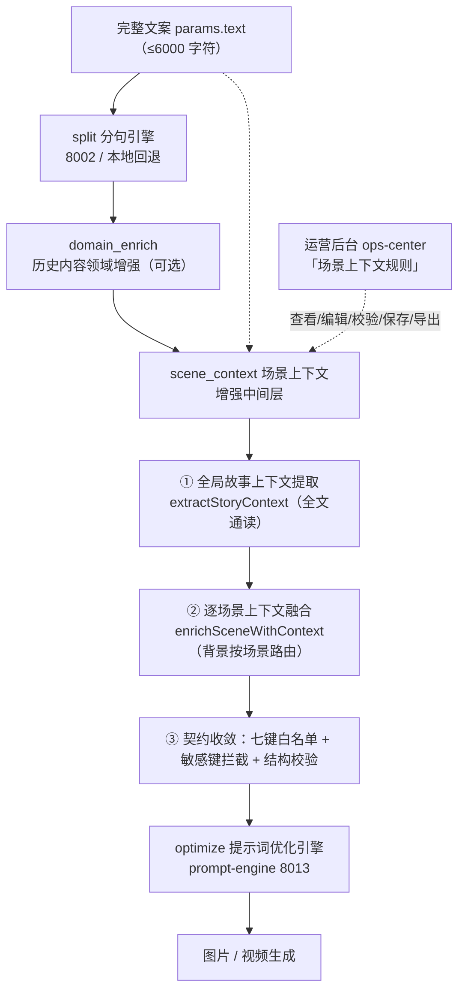
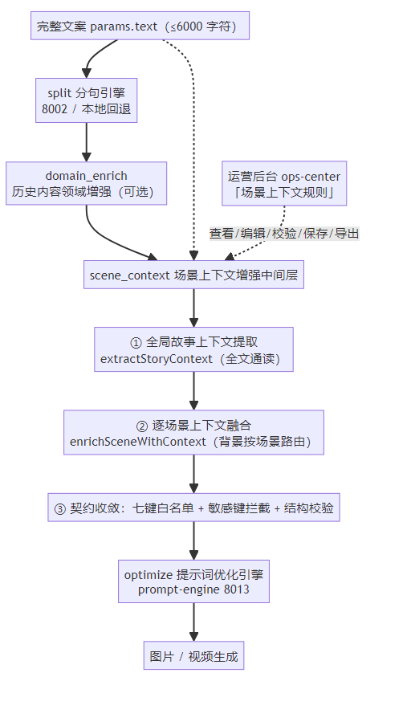

# PRD — Story2Video 场景上下文增强中间层

> 版本：2026-08-11 · 状态：需求定稿（随实现落地） · 关联：ARCH-STORY2VIDEO-SCENE-CONTEXT-2026-08-11.md（技术方案）、PRD.md §7.1.32

## 1. 背景与问题

Story2Video 的「文案 → 分句引擎（8002/本地）→ 图片提示词优化引擎（prompt-engine 8013）→ 图片/视频生成」串行流程中，**分句引擎与提示词优化引擎之间缺少一个故事背景上下文层**：

- 分句结果只携带「场景自身文字」，不含全文故事背景。
- 提示词优化引擎只拿到单场景文字，无法感知全文设定。
- 当场景文字缺少时代/地域/文化锚点时，模型会按训练分布自由发挥，产生**背景漂移**。

### 典型问题示例

> 全文讲的是中国唐代的故事，但其中一个场景层的分句结果只有一句「一个老妇人在做饭」。

当前链路下，提示词优化后的图片/视频很可能是：**一位西方老太太，在西式现代厨房中，用电烤箱做西餐**——时代、地域、人物形象、器具全部漂移。

### 问题本质

| 层面 | 现状 | 期望 |
|---|---|---|
| 信息 | 场景孤立、无全局背景 | 场景携带全文故事背景 |
| 时代 | 依赖单场景关键词，缺失即泛化 | 由全文确定时代/朝代并下发 |
| 地域/文化 | 无 | 由全文确定文化地域（中国/日本/欧洲…）并下发 |
| 人物 | 无角色一致性信息 | 角色及形象特征随场景传递 |
| 道具 | 无时代道具约束 | 时代道具锚点 + 时代负面锚点（防现代器具混入） |
| 连贯性 | 每个场景独立生成 | 全局一致性锚点贯穿所有场景 |

## 2. 目标与范围

### 2.1 目标

1. 在「分句 → 提示词优化」之间新增**故事背景上下文中间层**（场景上下文增强），让每个场景的提示词优化都携带全文故事背景。
2. 提升生成内容的**准确性**（背景不漂移）、**一致性**（多场景共享同一世界设定）、**连贯性**（前文设定延续到后续场景）。
3. 全部规则本地可执行、可测试，不新增外部服务依赖；不改变既有流水线成功/失败语义。

### 2.2 非目标（本期不做）

- 不修改 prompt-engine（8013）服务端契约（仅消费其已支持的 context 键）。
- 不做 LLM 驱动的全局上下文抽取（预留 `method: 'llm'` 扩展位，本期 `rule-based`）。
- 不做真实图片/视频生成的视觉断言验收（外部边界，见 §8）。
- 不新增用户必须手动填写的表单（自动分析为主；UI 仅展示分析结果，见 §6）。

## 3. 用户故事

- 作为创作者，我输入一篇讲中国唐代的文案，其中某个场景写「一个老妇人在做饭」，我希望生成的图片是唐代中国老妇人在长安民居土灶厨房做饭，而不是西方老太太用烤箱。
- 作为创作者，我希望同一篇文案里的所有场景共享同一时代、地域、角色与道具设定，不出现前后矛盾。
- 作为创作者，当我的文案是普通现代生活内容时，我希望系统不强行套用古代或异域设定。

## 4. 功能需求

### F1 全局故事上下文自动提取（核心）

系统读取**完整文案**，自动提取结构化故事背景（规则驱动，可解释，可测试）：

| 字段 | 说明 | 示例 |
|---|---|---|
| `genre` 题材 | 历史/武侠/仙侠/科幻/奇幻/都市/童话/悬疑/战争/宫廷/日常 | `历史` |
| `era` 时代 | ancient / modern / future / mixed / general | `ancient` |
| `dynasty` 朝代 | 命中的朝代及年代、置信度、证据词 | `唐朝（618-907）`，evidence `[唐代, 长安]` |
| `culture` 文化地域 | 中国/日本/欧洲/美国/阿拉伯/埃及/印度/韩国… | `中国` |
| `region` 地域 | 具体地点（城市/地标） | `长安` |
| `setting` 场景设定 | 宫殿/市井/厨房/书房/庭院/战场… | `民居厨房` |
| `time` 时间 | 昼夜/季节（可缺省） | `黄昏` |
| `characters` 角色 | 人物名+形象描述+出现次数 | `老妇人` |
| `props` 时代道具 | 古代道具 / 现代道具 | 古代：`土灶、柴火、陶罐` |
| `visualStyle` 视觉风格 | 写实/水墨/动漫/电影感… | `唐代写实、金红色盛唐光线` |
| `tone` 叙事语气 | 平和/悲壮/欢快… | `平和` |
| `summary` 一句话梗概 | 全文压缩摘要（≤300 字） | 见 §5.2 |
| `anchors` 一致性锚点 | 贯穿全部场景的关键设定词 | `[唐代, 中国, 长安城]` |
| `negativeAnchors` 负面锚点 | 时代/地域明确排除的元素 | `[电烤箱, 西式现代厨房]` |

### F2 逐场景上下文融合

对每个场景，把全局锚点融合进场景文字，生成：

1. **`storyContext` 上下文块**（自然语言，≤400 字）：`{文化}{朝代}时期，{地域}{场景设定}中，{场景原文}；视觉{视觉风格}；光线{语气}`。
2. **`anchors`**：该场景适用的一致性锚点。
3. **`negativeAnchors`**：该场景适用的时代负面锚点（如场景含做饭/烹饪且 era=ancient → 追加 `电烤箱/微波炉/西式现代厨房`）。
4. **`character`**：场景中命中的角色（供角色一致性）。

### F3 提示词优化注入

optimize 阶段调用 prompt-engine 时，请求 `context` 携带场景上下文块，映射到 prompt-engine 已知键：

| 请求键 | 内容 |
|---|---|
| `synopsis` | 全文一句话梗概 |
| `full_text` | 完整文案（服务端截断 500） |
| `setting` | 该场景 storyContext 上下文块 |
| `narrative_intent` | 叙事语气/意图 |
| `scene_type` | 场景类型（全景/特写/对比…，沿用现有推断） |
| `character_list` | 全局角色列表 |
| `character` | 当前场景角色 |

同时把该场景 `negativeAnchors` 合并进请求 `negative_prompt`（≤500 字）。

### F4 流水线集成

新增 `scene_context` 阶段，位置：`split → domain_enrich → scene_context → optimize`；默认启用；失败/降级语义见 §5.5。

### F5 配置项（scene_context）

| 配置 | 默认 | 范围 | 说明 |
|---|---|---|---|
| `enabled` | true | boolean | 是否启用上下文增强 |
| `maxSummaryLength` | 300 | 50..1000 | 一句话梗概最大字数 |
| `maxAnchors` | 8 | 1..20 | 一致性锚点最大条数 |
| `includeNegativeAnchors` | true | boolean | 是否注入时代负面锚点 |
| `contextBlockMaxChars` | 400 | 50..1000 | 单场景上下文块最大字数 |

## 5. 详细设计要点

### 5.1 数据校验

- **输入**：`fullText` 非空字符串（≤6000 Unicode 字符，沿用 Story2Video 文案上限）；`scenes` 非空数组，逐项提取 `imagePromptSeed/prompt/text/content` 任一非空文本。
- **配置收敛**：数值越界收敛到边界，类型非法回退默认（见 F5 范围）。
- **上下文对象白名单**：发送 prompt-engine 的 context 只允许七键（synopsis/full_text/setting/narrative_intent/scene_type/character_list/character），防止字段漂移。
- **敏感键拦截**：构造后发送前执行 `assertNoSensitiveContext`（api_key/token/secret/password 等键名拒绝），上下文内容不把敏感凭据外发。
- **负面锚点合并**：合并后 `negative_prompt` ≤500 字符（超长按契约截断）。
- **fail-closed**：输入场景数组缺失/为空 → 阶段失败并返回明确错误，不伪造场景。

### 5.2 流程

```
用户提交文案
  → split：分句为 N 个场景（8002 或本地回退）
  → domain_enrich：历史内容 per-scene 领域增强（保留）
  → scene_context：读全文 + 场景 → 全局故事上下文 + 逐场景上下文块
  → optimize：逐场景带上下文调 prompt-engine（并发3，重试，断点续传，进度）
  → select_video_scenes / generate_assets（图片+视频+TTS）/ compose / publish
```

### 5.3 功能逻辑

- 场景上下文块生成算法（伪代码）：
  ```
  sceneContext = culture + dynasty.period(或era描述) + "时期，"
               + region + 场景内setting(或全局setting) + "中，"
               + sceneText + "；视觉" + visualStyle + "；光线" + tone
  negativeAnchors(scene) = story.negativeAnchors
      + (scene 含做饭/烹饪 且 era=ancient ? [电烤箱,微波炉,西式现代厨房] : [])
      + (scene 含做饭/烹饪 且 era=modern  ? [土灶,柴火] : [])
  ```
- 时代互斥：era=ancient 时 props 只输出古代道具；era=modern 时只输出现代道具；`mixed/general` 不输出时代道具。
- 无关键词文案：`genre=general / era=mixed / culture=''`，summary 截取全文开头，不做时代编造；场景上下文块仅基于场景文字（与现行为等价，保证不回归）。

### 5.4 交互逻辑

| 时机 | 交互 |
|---|---|
| 提交文案 | 自动执行，无需用户操作 |
| 分析中 | 流水线 `scene_context` 阶段进度可见（走通用阶段进度） |
| 分析完成 | 结果随 `context.scene_context` 保留在运行上下文中，历史记录可查看（不新增独立页面） |
| 失败 | 按 §5.5 降级/失败，错误信息进入流水线错误提示 |

### 5.5 降级与失败

| 场景 | 行为 |
|---|---|
| 规则引擎异常（单个场景） | 该场景透传原文字，`metadata.degraded=true` + `fallbackReason`；不阻断流水线 |
| 全文为空 / scenes 为空 | 阶段失败（fail closed） |
| 用户禁用（enabled=false） | 阶段透传，`metadata.degraded=true`（reason: disabled） |
| prompt-engine 不可用 | 沿用 optimize 既有语义（明确失败/重试），与本文档无关 |

## 6. 显示项与提示文字

### 6.1 显示项（本期）

- 流水线阶段列表显示 `scene_context`（阶段名「场景上下文增强」）。
- 优化进度仍显示「共 N 个场景，已完成 M 个」。
- 上下文增强结果不新增独立 UI 面板；通过历史记录/调试日志可见 `story` 字段（题材/时代/地域/锚点等）。

### 6.2 提示文字（新增文案）

| 位置 | 文案 |
|---|---|
| 阶段描述 | 「场景上下文增强」 |
| 阶段进度标题（如启用） | 「正在理解全文故事背景…」 |
| 失败提示 | 「场景上下文增强失败：{原因}（已降级，按原文继续生成）」 |
| 输入缺失（fail closed） | 「场景上下文增强需要非空文案与场景数组」 |

## 7. 验收标准

1. 【回归】全文含「唐代/长安」、场景为「一个老妇人在做饭」→ story 识别唐朝/中国/长安，场景上下文块含土灶/柴火锚点，负面锚点含电烤箱/西式现代厨房（自动化测试断言）。
2. 【回归】普通现代文案 → 不套用古代设定，无时代负面锚点。
3. 【契约】optimize 请求 context 仅含白名单七键，且经过敏感键拦截。
4. 【配置】越界配置收敛到边界，默认值生效。
5. 【降级】规则异常时透传 + degraded 标记，流水线继续。
6. 【fail-closed】空场景输入阶段失败。
7. 【流程】流水线阶段顺序含 scene_context，且旧行为（无 scene_context 配置）不回归。
8. 【文档】PRD/技术方案/CHANGELOG/learnings/.quality-gates 已同步。

## 8. 验收边界（外部）

- 真实图片/视频生成效果（西方老太太问题是否消除）依赖 prompt-engine 与图片/视频生成厂商模型行为，属于**外部验收边界**：本期以「注入上下文锚点提高生成概率」为交付口径，不做第三方视觉断言。
- 需要真实 LLM key 与图片生成额度，由真实使用验收单独记录。

---

## 9. 概念与逻辑细化（2026-08-12）

> 主 PRD §7.1.33 已扩写为 9 小节详细版（概念/数据流/字段表/规则表/融合算法/配置校验/降级/运营后台/验收）。本节点名关键概念与逻辑，供评审与实施对齐。

### 9.1 概念定位：故事背景上下文「路由层」

`scene_context` 不是新的生成引擎，而是**上下文路由层**：

```
分句引擎（场景生产方） ──场景文字──►  scene_context（故事背景路由层）  ──场景+全局背景──►  提示词优化引擎（场景消费方）
                                           │
                                    全文通读 → 全局故事上下文
                                    按场景融合 → 逐场景上下文块 + 时代负面锚点
```

- **生产方/消费方解耦**：分句引擎不知道下游消费的是提示词优化；提示词优化不直接读全文。中间层承担「全文理解 + 按场景路由背景」的单一职责。
- **默认对一切内容生效**：不同于 `domain_enrich`（仅 history），`scene_context` 对历史/现代/无关键词文案都执行；无关键词时退化为「仅场景文字」等价旧行为。





### 9.2 核心逻辑速览

| 环节 | 逻辑 | 关键约束 |
|---|---|---|
| 全局提取 | 关键词计数 → 题材/朝代/文化/设定/角色/道具/风格/语气 | 多候选排序 + 置信度；无关键词不编造 |
| era 判定 | 朝代命中→strong；否则 ≥2 独立信号 | 弱信号不注入全局负面锚点 |
| 时代互斥 | ancient 只输出古代道具；modern 只输出现代道具 | 防跨时代混搭 |
| 逐场景融合 | 全局锚点 + 场景文字 → 上下文块/锚点/负面锚点/角色 | 措辞自然；做饭×古代 → 土灶/柴火 + 排除电烤箱 |
| 提示词注入 | 七键白名单 context + negative_prompt 合并 | 服务端已知键；敏感键拦截 |
| 规则加载 | env → userData 覆盖 → 内置 JSON → 空兜底 | 校验失败回退内置 + 告警 |
| 运营管理 | ops-center 查看/编辑/校验/保存/导出 | 与桌面端同构校验；双源同步断言 |

### 9.3 数据模型与规则表

- 全局 `story` 字段表（genre/era/dynasty/culture/region/setting/time/characters/props/visualStyle/tone/summary/anchors/negativeAnchors/confidence/evidence/multiCandidates）：见主 PRD §7.1.33(3)。
- 规则表（16 朝代 / 8 文化 / 11 题材 / 10 设定 / 道具 ancient+modern / 41 角色 / 时间 / 7 视觉风格 / 4 语气 / 负面锚点互斥）：见主 PRD §7.1.33(4)；规则以 `story-context-rules.json` 承载并可被运营后台管理。
- **完整 JSON 样例**：`context.scene_context`（story/scenes/metadata）与 `story-context-rules.json` 规则结构的完整样例见主 PRD §7.1.33(3)（含用户示例的逐字段取值）。
- 逐场景融合算法（location 拼接/做饭锚点/角色识别/负面锚点合并）：见主 PRD §7.1.33(5)。

### 9.4 运营后台规则管理（2026-08-12）

- 页面「运营 → 场景上下文规则」（`/scene-context-rules`）：JSON 编辑 / 校验 / 保存 / 导出 `story-context-rules.json`，展示来源/版本/更新人；未配置时基于模板编辑。
- API：`GET/POST validate/PUT/GET export /api/v1/scene-context/rules`（登录读、admin 写；非法规则 400 拒绝）。
- 生效方式：合入随包发布 或 `<userData>/config/story-context-rules.json` 覆盖加载（桌面校验失败自动回退内置）。
- 同步保障：ops-center 模板与桌面内置 JSON 由 pytest 断言归一化相等。

### 9.5 验收证据（本地可复现）

- **L1 引擎直调**：唐代全文 + 「一个老妇人在做饭」→ `唐朝·中国·长安`、上下文块含「土灶/柴火/陶罐/铜锅」、负面锚点含「电烤箱/微波炉/西式现代厨房」；无关键词不编造；现代文案不误判古代；城堡题材不编造城市。
- **L2 真实 prompt-engine A/B（8013，真实 LLM）**：A 组（带 scene_context）提示词含 `Tang Dynasty / Chang'an / Chinese / earthen stove / firewood / clay pot`；B 组（对照组）无时代/地域锚点 → **PASS**（中间层把背景锚点真实注入下游提示词，负面提示随请求生效）。
- 完整记录：`01-docs/STORY2VIDEO-SCENE-CONTEXT-ACCEPTANCE-2026-08-12.md`。
- 外部边界：真实图片/视频生成效果依赖厂商模型行为，属外部验收（L3 真实出图可复用已配置的 minimax-image 进行）。
