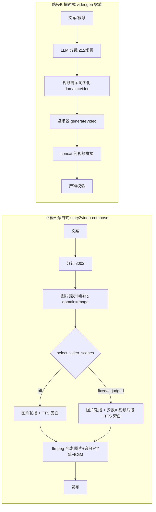

# 视频生成双模式分析报告（2026-08-13）

> 快照日期：2026-08-13（基于 `main` @ b0053cef）
> 结论口径：以 **Electron JS 侧 `PipelineEngine` stageDefs 为实际执行权威**；Python YAML manifest 为契约层。
> 关联文档：[PIPELINE-MATRIX.md](./PIPELINE-MATRIX.md)（14 条流水线总览）。

## 0. 结论先行

用户提出的两种视频生成情况**方向正确，两处需要精化**：

| 表述 | 验证结果 |
|---|---|
| ✅ 情况一：文案作为旁白，TTS 语音 + 字幕，分句后提示词优化再生成视频，整体合成 | **基本成立**，但主流实现是「分句 → 图片提示词优化 → **图片轮播**成片 + TTS 旁白 + 字幕」；AI 视频只是**可选增强**，且只用于少数精选场景 |
| ✅ 情况二：文案直接作为视频描述（提示词）生成视频，不需要旁白 | **方向成立但机制不同**：不是整段文案直接喂视频模型，而是 LLM 先拆分成镜场景（每场景一个视频提示词），逐场景生成后纯视频拼接 |
| ❌（隐含假设）两种模式共用同一「生成视频」语义 | **不成立**：两条路径的提示词来源、优化 domain、音频/字幕、合成方式完全不同，是两套独立阶段链 |

---

## 1. 路径 A：旁白式（Story2Video 标准模式 + 视频增强）

### 1.1 代码路径（9 阶段编排）

`apps/desktop/electron/services/pipeline-engine.js:480-660`（stageDefs）→ `story2video-stages.js`（阶段执行器）→ `story2video-compose-engine.js`（ffmpeg 合成）。

```
文案(text)
  → split          分句（smart-sentence-splitter :8002）
  → domain_enrich  历史内容领域增强（可选）
  → scene_context  场景上下文增强
  → optimize       每句 → 图片提示词（prompt-engine domain=image，:8013）
  → select_video_scenes   【可选】挑 N 个场景用 AI 视频（off/fixed/ai-judged）
  → generate_assets 并行：图片生成 + TTS 旁白（+ 选中场景生成 AI 视频片段）
  → finalize_assets 素材确认（manual 模式）
  → compose        ffmpeg 合成：图片轮播/视频片段 + 旁白音轨 + 字幕 + 转场/BGM/水印
  → publish        多平台发布
```

### 1.2 关键证据（file:line）

- **旁白是必生成物**：`story2video-stages.js:2056-2136` TTS 与图片并行生成，`ttsTotal = sentences.length`（:588），每场景 `audioPath` 写入素材清单（:2202）。
- **视频增强只是"部分场景"**：`select_video_scenes` 阶段（`pipeline-engine.js:554-570`）三种模式——`off`（纯图片轮播）/ `fixed`（前段按序约 25%）/ `ai-judged`（LLM 按精彩度选，占比钳制 20-40% 且 ≤3 个场景，`01-docs/PRD-video-creation.md:174`）。
- **视频场景的提示词来自图片提示词改写**：`story2video-stages.js:616-626` — 先用分句优化后的图片 prompt，再经 `optimizeVideoPrompt`（domain=video）改写，失败则回退该场景为图片轮播（不中断整线）。
- **生成视频的契约与旁白不分离**：`generateSceneVideo`（:441-）调 `generateVideo → getVideoStatus 轮询(≤10min) → 下载`；PRD 明确「视频场景片段必须显式携带 TTS 旁白音频」。
- **合成含音频轨**：compose 引擎合并旁白 `narration.m4a`（`story2video-compose-engine.js:899-905`）、可选 BGM 混音（:933-941）、字幕烧录。

### 1.3 一句话

**文案 = 旁白**；画面以「图片轮播」为默认，「AI 视频片段」是叠加在少数场景上的增强；音频轨与字幕是常态。

---

## 2. 路径 B：描述式（videogen 家族：animation / avatar-spokesperson / character-animation / hybrid）

### 2.1 代码路径（4 阶段编排）

`pipeline-engine.js:210-249, 350-361`（stageDefs）→ `videogen-stages.js`（阶段执行器）。

```
文案/概念(text)
  → videogen_script      LLM 生成口播/解说文案（avatar/hybrid 用）
  → videogen_storyboard  LLM 拆分为 ≤12 个视频场景 [{prompt, text, duration}]
  → videogen_generate    每场景：prompt-engine(domain=video) 批量优化 → generateVideo → 轮询 → 下载
  → videogen_merge       ffmpeg concat 纯视频拼接
  → render               产物校验
```

### 2.2 关键证据（file:line）

- **无旁白、无字幕、无音频轨**：`videogen-stages.js` 全文件无 TTS/audio/subtitle/narration 引用（检索零命中）；merge 用 `ffmpeg -f concat -c copy` **纯视频流拷贝拼接**（:807-812），没有音频合成。
- **提示词直接供视频模型使用**：storyboard 的 system prompt 要求每个场景输出 `{"prompt": "画面提示词（主体/动作/构图/光线/风格，供视频生成模型直接使用）", "text": "解说文案", "duration": 4-8}`（:293、:311）。注意这里的 `text` 是**场景解说文案字段**，用于 prompt-engine context，不是 TTS 旁白。
- **生成前统一优化**：`videogen_generate` 先 `optimizeVideoPromptsBatch`（domain=video，批量 ≤20 条，数量/空项 fail-closed，:649-708），失败不静默回退。
- **逐场景生成 + 拼接**：每场景 `generateVideo` 带 `width/height/numFrames/frameRate`（:714-734，帧数按 storyboard duration 经 8n+1 规则映射，:166-172）；全部成功才进 merge（:774-777）。
- **文案分段仅作优化上下文**：fidelity 模式下 `segmentScript(fullText)` 把全文分段注入 prompt-engine context（:506、:665），**不是**用于生成旁白。

### 2.3 一句话

**文案 = 视频描述**；LLM 分镜后逐场景直接生成 AI 视频，成品无旁白音轨、无字幕，纯视频拼接。

---

## 3. 五维对比表

| 维度 | 旁白式（Story2Video 标准） | 描述式（videogen 家族） |
|---|---|---|
| **文案语义** | 文案 = 旁白（读出来的内容） | 文案 = 视频内容描述（看到的画面） |
| **提示词链路** | 分句 → `domain=image` 图片优化 → 少量场景再 `domain=video` 改写 | 概念/文案 → LLM 分镜 → `domain=video` 批量优化 |
| **音频轨** | TTS 逐段旁白必生成 + 可选 BGM + `narration.m4a` | 无（纯视频） |
| **字幕** | compose 可选字幕烧录（subtitleEnabled） | 无字幕能力 |
| **合成** | ffmpeg 富合成：图片+视频片段+音频+转场+BGM+水印+字幕（`-filter_complex`） | ffmpeg `concat -c copy` 纯拼接 |
| **时长模型** | `follow-audio`（以 TTS 音频真实时长为准，ffprobe 二次校验） | storyboard `duration` → 8n+1 帧数档位 |
| **供应商** | 图片生成器 + TTS + 视频生成器（增强可选）+ prompt-engine(8002/8013) | 视频生成器 + LLM + prompt-engine(8013) |
| **UI 入口** | 「输入视频文案、主题描述或脚本」（`CreateView.vue:79`） | 「口播文案（口播视频流水线必填）」（`CreateView.vue:137-139`） |
| **代表流水线** | `story2video-compose` | `animation` / `avatar-spokesperson` / `character-animation` / `hybrid` |

---

## 4. 数据流图



---

## 5. 边界澄清（不属于这两类的流水线）

1. **快速渲染**（`apps/desktop/src/views/CreateView.vue:810-846, 3381-3393`）：`quickText` 每行一个场景 → **Remotion 渲染**（renderStart/renderComplete 事件），不是 PipelineEngine，也不是视频生成——是独立渲染器路径。
2. **素材类流水线**：`talking-head`（上传视频+字幕烧录）、`localization-dub`（视频翻译配音）、`cinematic`（调色）、`clip-factory`（切片）、`documentary-montage`（LLM 大纲+图片+旁白，近似路径 A 的变体）、`podcast-repurpose`（音频→配图）。
3. **严格的「整段文案 → 单个完整视频」直出**：注册表中**不存在**。两条路径都是分段式（路径 A 是分句成场景，路径 B 是 LLM 分镜成场景）。唯一的"整段直出"近似是视频 provider 内部支持长提示词，但编排层没有直接暴露。

---

## 6. 附录：两模式 × provider × 提示词契约

### 6.1 provider 层（`packages/python-backend/src/multi_publish/video_creation/providers/`）

| 能力 | 旁白式 | 描述式 | 实现目录 |
|---|---|---|---|
| 图片生成 | ✅ 主画面来源 | ❌ 不使用 | `providers/image/*`（Flux/OpenAI/Imagen/Grok/Recraft/ComfyUI/local diffusion/Pexels/Pixabay/图表/数学动画 等） |
| TTS 旁白 | ✅ 必生成 | ❌ 不使用 | `providers/audio/*`（OpenAI/Google/ElevenLabs/豆包/Piper） |
| 视频生成 | ✅ 增强（≤40% 场景） | ✅ 全部场景 | `providers/video/*`（Kling/Runway/Veo/MiniMax/Seedance/Hunyuan/HeyGen/CogVideo/Grok/LTX 等） |
| 音乐/BGM | ✅ 可选 | ❌ | `providers/audio/*`（Suno/Freesound/Pixabay/music_library） |
| LLM 分镜/文案 | ❌（不生成视频分镜；仅场景上下文） | ✅ storyboard/script 阶段 | `callDefaultLlm`（videogen-stages.js:459-561） |

### 6.2 prompt-engine 双 domain 契约（:8013）

| 维度 | domain=image（旁白式 optimize） | domain=video（两模式视频提示词） |
|---|---|---|
| 调用方 | `story2video_optimize` 逐场景 `serviceBus.optimizePrompt` | `videogen_generate` 批量 `optimizeVideoPromptsBatch`；Story2Video 混合场景 `optimizeVideoPrompt` |
| 输入 | 分句后的每句文本 | storyboard 场景 prompt / 图片提示词改写 |
| 失败语义 | 校验失败即报错；LLM 拒绝/过短时保留原文并标记 | 未注入 PromptBridge 明确失败；批量数量/空项 fail-closed；混合模式失败回退图片轮播 |
| 契约文件 | 图片契约（story2video optimize 校验） | `video-prompt-engine-contract.js`（与图片契约分文件分命名） |
| 上线日期 | 既有 | 2026-08-12（PR #548 + prompt-engine #18，PRD 7.1.33） |

### 6.3 提示词结构差异

- **旁白式**：`句子 → 图片提示词（风格/构图/色彩）→（选中场景）改写为视频提示词`；场景时长由 TTS 音频驱动。
- **描述式**：`概念/文案 → LLM 分镜 {prompt, text, duration} → 每场景独立视频提示词`；场景时长由 storyboard duration 驱动（8n+1 帧数档位）。

---

## 7. 结论与建议

1. **裁定**：情况一 ✅（细节：默认图片轮播 + 旁白，AI 视频是增强）；情况二 ✅（细节：LLM 分镜 + domain=video 优化，非字面"直接"）。
2. **两者关系**：两套独立阶段链，共享的只有视频 provider 池与 prompt-engine 8013。
3. **产品含义**：旁白式产出「解说型短视频」，描述式产出「画面型视频」。
4. **若要新增「文案直出整段视频且无旁白」**：最快路径是基于 videogen 家族加一条 text-to-video 流水线（沿用 storyboard + domain=video 优化链），或在 Story2Video 把 `select_video_scenes` 的 `fixedRatio` 提至 100%（全场景视频）。

## 8. 出处索引

- `apps/desktop/electron/services/pipeline-engine.js`：PIPELINES 注册表（:52-662）、story2video 9 阶段（:480-660）、videogen 家族（:210-249, :350-361）
- `apps/desktop/electron/services/story2video-stages.js`：generate_assets 图片+TTS+视频并行（:1747-2241）、generateSceneVideo（:441-）、finalize_assets（:2338-2498）
- `apps/desktop/electron/services/videogen-stages.js`：storyboard/generate/merge（:293-311, :637-834）
- `apps/desktop/electron/services/story2video-compose-engine.js`：旁白/BGM/转场合成（:899-941）
- `apps/desktop/src/views/CreateView.vue`：输入区（:79, :137-139）、快速渲染（:810-846, :3381-3393）
- `packages/python-backend/src/multi_publish/video_creation/providers/{image,video,audio}/`：供应商实现
- `01-docs/PRD-video-creation.md`：视频增强规则（:174）、prompt-engine video 领域（:148, :317）、创作模式收敛（:56,68,212-213）
