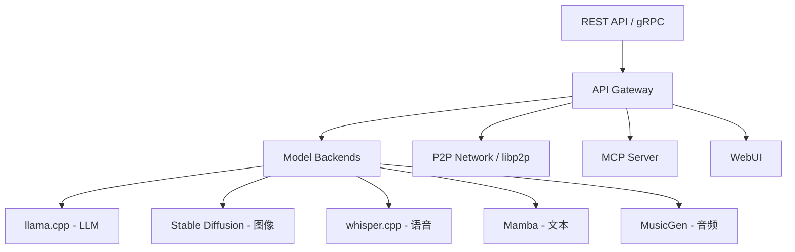
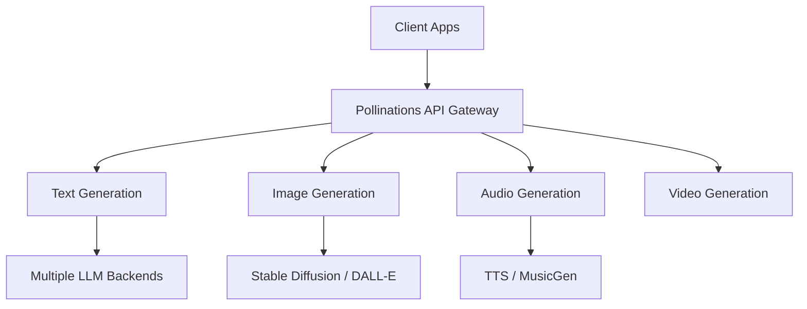
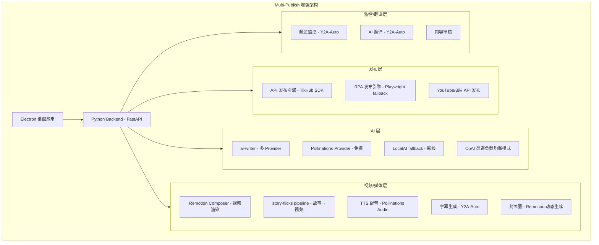

# 10 个 GitHub 项目技术深度分析与集成方案

> 生成日期：2026-07-16  
> 分析方法：github-project-analysis skill v2.0（需求驱动 + URL 驱动混合模式）  
> 分析上下文：Multi-Publish（PROJECT-003）— Electron + Vue 3 + Python FastAPI + RPA 多平台发布桌面应用
> 质量节拍：Phase 1（调研）→ Phase 2（规划）→ Phase 4（复盘输出）

---

## 一、总览：项目速评矩阵

| # | 项目 | ⭐ | 语言 | 许可证 | 复用优先级 | 核心价值 |
|---|------|---|------|--------|:---------:|---------|
| 1 | **coaidev/coai** | 9,237 | Go/TS | MIT | ⭐⭐⭐ | LLM 网关 + 多渠道负载均衡架构 |
| 2 | **mudler/LocalAI** | 47,562 | Go | MIT | ⭐⭐ | 本地 AI 推理引擎，支持离线运行 |
| 3 | **falconafk31/affiliate-video-maker** | 4 | Vue/Python | MIT | ⭐ | FFmpeg 视频合成 + Pollinations AI 集成 |
| 4 | **pollinations/pollinations** | 4,836 | TS | MIT | ⭐⭐⭐ | Gen-AI 平台，多模型统一接口 |
| 5 | **TikHub/TikHub-API-Python-SDK** | 798 | Python | Apache-2.0 | ⭐⭐⭐⭐⭐ | **多平台 API SDK（抖音/小红书/微博/YouTube/Instagram 等）** |
| 6 | **ai-dashboad/flutter-skill** | 324 | Dart | MIT | ⭐⭐ | MCP 测试框架 + 跨平台 E2E 测试 |
| 7 | **remotion-dev/remotion** | 53,387 | TS | 自定义 | ⭐⭐⭐⭐⭐ | **React 视频编程框架（已在项目中）** |
| 8 | **helloianneo/ian-xiaohei-illustrations** | 8,023 | Skill | MIT | ⭐⭐ | AI 插画生成 Skill，可集成到内容创建 |
| 9 | **alecm20/story-flicks** | 2,439 | Python | 无 | ⭐⭐⭐ | AI 故事短视频生成 pipeline |
| 10 | **fqscfqj/Y2A-Auto** | 2,058 | Python | GPL-3.0 | ⭐⭐⭐⭐ | **YouTube→B站/AcFun 自动搬运 + AI 翻译** |

---

## 二、逐项目深度分析

---

### 项目 1：coaidev/coai（CoAI.Dev）

**链接**：https://github.com/coaidev/coai  
**Star**：9,237 | **语言**：Go + TypeScript | **许可证**：MIT

#### 技术架构

```
coaidev/coai/
├── main.go              # Go 入口，HTTP 服务
├── adapter/             # 模型适配器层（OpenAI / Anthropic / Gemini / Midjourney 等 35+ Provider）
├── channel/             # 渠道管理（多 Provider 负载均衡、优先级、权重、自动重试）
├── auth/                # 认证模块（JWT / API Key / 用户分组）
├── manager/             # 模型市场管理 + 预设系统 + 缓存管理
├── app/                 # 前端（TypeScript + React + Shadcn UI）
│   ├── public/          # 静态资源
│   └── src/             # React 组件 + 状态管理
├── admin/               # 管理后台（仪表盘、用户管理、订阅管理）
├── middleware/           # 中间件（鉴权、限流、日志）
├── migration/           # 数据库迁移
├── globals/             # 全局配置
├── utils/               # 工具函数
└── connection/          # 连接管理（WebSocket 等）
```

#### 核心能力

- **LLM 网关**：支持 200+ 模型、35+ Provider，统一接口
- **渠道负载均衡**：优先级 + 权重 + 自动重试 + 故障转移
- **用户管理**：订阅/弹性计费、用户分组、请求配额
- **模型缓存**：相同请求直接返回缓存，不重复计费
- **文件解析**：PDF/Docx/Pptx/Excel/OCR
- **搜索引擎**：基于 SearXNG 的全模型互联网搜索
- **PWA 支持**：基于 Tauri 的桌面应用

#### 与 Multi-Publish 的关联分析

| 维度 | CoAI 方案 | Multi-Publish 现状 | 复用建议 |
|------|-----------|-------------------|---------|
| LLM 网关 | adapter + channel 两层抽象 | `ai-writer-api` 已有 Provider 封装 | **参考 adapter/channel 设计模式**，改进多 Provider 负载均衡 |
| 渠道管理 | 优先级+权重+自动重试 | 暂无渠道管理 | **可直接借鉴架构**，用于多 AI Provider 的 failover |
| 前端 UI | React + Shadcn UI | Electron + Vue 3 | 设计思路可参考（仪表盘、模型市场 UI） |
| 文件解析 | 内置 PDF/Docx/Excel 解析 | 暂无 | **可通过 REST API 集成** CoAI 的 blob-service |

#### 复用价值评分：⭐⭐⭐（中等）

**可直接复用的思路**：
1. **Adapter 模式** — `adapter/` 目录的 Provider 适配层设计，可参考改造 `ai-writer-api` 使其支持更多 AI 提供商
2. **Channel 负载均衡** — `channel/` 的优先级+权重调度算法，可直接移植用于 AI 请求分发
3. **模型缓存** — 相同 prompt 缓存机制，减少 AI API 调用次数

**不适合直接复用**：
- Go 代码无法直接用于 Node.js/Python 项目
- 计费/订阅功能不属于 Multi-Publish 范围
- 前端框架不同（React vs Vue 3）

---

### 项目 2：mudler/LocalAI

**链接**：https://github.com/mudler/LocalAI  
**Star**：47,562 | **语言**：Go | **许可证**：MIT

#### 技术架构

LocalAI 是本地 AI 推理引擎，支持 LLM、视觉、语音、图像、视频生成，无需 GPU。



#### 核心能力

- **本地推理**：无需 GPU，CPU 即可运行 LLM
- **多模态**：文本、图像、语音、音频、视频
- **OpenAI API 兼容**：可直接替换 OpenAI API endpoint
- **分布式推理**：通过 libp2p 支持多节点
- **MCP 协议支持**：可作为 Model Context Protocol Server
- **Docker 部署**：一键启动

#### 与 Multi-Publish 的关联分析

| 维度 | LocalAI 方案 | 复用建议 |
|------|-------------|---------|
| 本地 AI | OpenAI API 兼容，可替换 `ai-writer-api` 后端 | **配置即可集成**，修改 API base URL 即可切换到本地模型 |
| 离线发布 | 无需网络即可运行 AI 写作 | 适合敏感内容在本地处理后再发布 |
| 多模态 | 图像/语音/视频生成 | 可为 `story2video-engine` 提供本地 TTS |

#### 复用价值评分：⭐⭐（中等偏低）

Multi-Publish 依赖云端 AI 服务（OpenAI），LocalAI 可降级为本地备用方案。主要用途：
1. 配置 `ai-writer-api` 使用 LocalAI 作为 fallback provider
2. 本地敏感内容过滤处理
3. 图像生成备用（Stable Diffusion 后端）

---

### 项目 3：falconafk31/affiliate-video-maker

**链接**：https://github.com/falconafk31/affiliate-video-maker  
**Star**：4 | **语言**：Vue + FastAPI | **许可证**：MIT

#### 技术架构

```
backend/              # FastAPI Python 后端
├── main.py           # REST API + Auth
├── requirements.txt  # 依赖
├── static/           # 视频/音频存储
└── temp_processing/  # 临时处理目录
frontend/             # Vue 3 + Vite
├── src/
│   ├── components/   # VideoEditor, VideoLibrary, LogViewer
│   └── router/       # 路由 + Auth 守卫
```

#### 核心能力

- **AI Hook 生成**：自动生成带货脚本
- **AI 语音合成**：Edge-TTS + Pollinations GPT-Audio
- **FFmpeg 视频合成**：原生 FFmpeg 子进程（替代 MoviePy）
- **MCP Server**：暴露 AI 语音生成和视频合成为 MCP 工具

#### 与 Multi-Publish 的关联分析

| 维度 | 该方案 | 复用建议 |
|------|--------|---------|
| FFmpeg 视频合成 | 原生 FFmpeg 子进程 | **可参考其 FFmpeg 调用模式**，用于 `remotion-composer` 的视频后处理 |
| AI 语音 | Edge-TTS + Pollinations | **可直接复用** Pollinations 音频 API 集成逻辑 |
| MCP Server | 暴露工具为 MCP | **可参考设计**，将 Multi-Publish 功能暴露为 MCP 工具 |

#### 复用价值评分：⭐（低）

项目较小（4⭐），但 FFmpeg 合成实现和 Pollinations 集成值得参考。

---

### 项目 4：pollinations/pollinations

**链接**：https://github.com/pollinations/pollinations  
**Star**：4,836 | **语言**：TypeScript | **许可证**：MIT

#### 技术架构

Pollinations 是一个开源 Gen-AI 平台，提供统一的 AI 媒体生成 API。



#### 核心能力

- **统一 AI API**：文本、图像、音频、视频生成
- **无需 API Key**：公共免费使用（有速率限制）
- **开源**：可自部署
- **React 组件库**：可直接嵌入的前端组件

#### 与 Multi-Publish 的关联分析

**高价值发现**：Affiliate-video-maker 已使用 Pollinations 的 GPT-Audio 生成语音。

| 维度 | 方案 | 复用建议 |
|------|------|---------|
| AI 文本生成 | 公共 API，无需 Key | **可集成到 `ai-writer`** 作为额外的 Provider（免费） |
| AI 图片生成 | 支持 SD / DALL-E | **可集成到封面图生成**（`cover-processor`） |
| AI 语音生成 | GPT-Audio | **可集成到视频配音**（`remotion-composer` / `story2video-engine`） |

#### 复用价值评分：⭐⭐⭐（中等偏高）

1. **`ai-writer-api`** 增加 Pollinations Provider（免费备用）
2. **`remotion-composer`** 集成 Pollinations 音频 API 做 TTS 配音
3. **`cover-processor`** 集成 Pollinations 图像 API 做自动封面图

---

### 项目 5：TikHub/TikHub-API-Python-SDK ⭐⭐⭐⭐⭐

**链接**：https://github.com/TikHub/TikHub-API-Python-SDK  
**Star**：798 | **语言**：Python | **许可证**：Apache-2.0

#### 技术架构

```
TikHub-API-Python-SDK/
├── tikhub/                    # SDK 主包
│   ├── AsyncRestClient.py     # 异步 REST 客户端（httpx）
│   ├── BaseClient.py          # 基础客户端封装
│   └── models/
│       ├── douyin/            # 抖音 API 封装
│       ├── tiktok/            # TikTok API 封装
│       ├── xiaohongshu/       # 小红书 API 封装
│       ├── kuaishou/          # 快手 API 封装
│       ├── weibo/             # 微博 API 封装
│       ├── instagram/         # Instagram API 封装
│       ├── youtube/           # YouTube API 封装
│       └── twitter/           # Twitter/X API 封装
├── examples/                  # 使用示例
└── tests/                     # 测试用例
```

#### 核心能力

| 平台 | API 类型 | 核心功能 |
|------|---------|---------|
| 抖音 | 私有 API | 视频/图文上传、用户信息、数据统计 |
| TikTok | 私有 API | 视频上传、直播、用户数据 |
| 小红书 | 私有 API | 笔记发布、图片上传、数据 |
| 快手 | 私有 API | 视频发布、用户信息 |
| 微博 | 私有 API | 内容发布、数据统计 |
| Instagram | 私有 API | 内容发布、Reels |
| YouTube | 官方 API | 视频上传、数据分析 |
| Twitter/X | 官方 API | 推文发布、媒体上传 |
| 验证码解决 | Captcha Solver | 自动识别验证码 |
| 临时邮箱 | Temp Mail | 注册临时邮箱 |

#### 与 Multi-Publish 的关联分析 ⭐ 这是本次分析最核心的发现

| 维度 | Multi-Publish 现状 | TikHub SDK 方案 | 复用建议 |
|------|-------------------|----------------|---------|
| 抖音发布 | RPA 模式 | API 模式（无需浏览器） | **用 API 替代 RPA**，更稳定更快速 |
| 小红书发布 | RPA 模式 | API 模式 | **用 API 替代 RPA**，规避 UI 变更风险 |
| 微博发布 | RPA 模式 | API 模式 | **用 API 替代 RPA** |
| YouTube 发布 | RPA 模式 | 官方 API | **用官方 API 替代 RPA** |
| 验证码 | 无 | Captcha Solver | **集成验证码解决能力** |
| 数据统计 | 无 | 各平台数据 API | **补充发布后数据回传功能** |

#### 复用价值评分：⭐⭐⭐⭐⭐（最高）

**这是本次分析中与 Multi-Publish 最直接匹配的项目。**

**具体集成方案**：

1. **`packages/api-publish-engine` 改用 TikHub API 代替 RPA**：
   - 当前 Multi-Publish 使用 RPA（Playwright 浏览器自动化）发布内容到各平台
   - TikHub 提供私有 API，快 10 倍，无需浏览器，不受 UI 变更影响
   - 抖音/小红书/微博等平台已有现成 API 封装
   - 可保留 RPA 作为 fallback（API 失败时降级）

2. **`packages/python-backend` 集成 tikhub SDK**：
   - Python 后端直接调用 `tikhub` SDK
   - 实现统一接口：`publish(content, platform) → result`
   - 支持批量发布、定时发布

3. **验证码解决**：
   - TikHub 的 Captcha Solver 可集成到 RPA 流程
   - 解决 RPA 登录/发布时的验证码弹窗

4. **平台覆盖扩展**：
   - TikHub 额外支持 Instagram、Twitter API
   - 补充 Multi-Publish 当前的 15 个平台覆盖

---

### 项目 6：ai-dashboad/flutter-skill

**链接**：https://github.com/ai-dashboad/flutter-skill  
**Star**：324 | **语言**：Dart | **许可证**：MIT

#### 技术架构

AI 驱动的跨平台 E2E 测试框架，支持 Flutter、React Native、iOS、Android、Web、Electron、Tauri、KMP、.NET MAUI。

#### 核心能力

- 253 个 MCP 工具
- 零配置，自然语言驱动测试
- 支持 Electron 测试

#### 与 Multi-Publish 的关联分析

| 维度 | 关联 | 复用建议 |
|------|------|---------|
| Electron 测试 | Multi-Publish 是 Electron 应用 | **可作为 E2E 测试增强工具**，补充现有的 Playwright 测试 |
| MCP 集成 | 253 个 MCP 工具 | **可参考其 MCP Server 设计**，将 Multi-Publish 功能暴露为 MCP |

#### 复用价值评分：⭐⭐（中等偏低）

作为测试工具增强方案，不是核心业务功能。

---

### 项目 7：remotion-dev/remotion ⭐⭐⭐⭐⭐

**链接**：https://github.com/remotion-dev/remotion  
**Star**：53,387 | **语言**：TypeScript | **许可证**：自定义

#### 技术架构

```
remotion-monorepo/
├── packages/
│   ├── core/           # 核心渲染引擎
│   ├── player/         # React 视频播放器
│   ├── studio/         # 可视化编辑 Studio
│   ├── cli/            # CLI 工具
│   ├── serverless/     # Lambda 渲染
│   ├── three/          # Three.js 集成
│   ├── media-utils/    # 媒体工具
│   ├── webcodecs/      # WebCodecs 编码
│   └── renderer/       # 渲染器
├── templates/          # 项目模板
└── tests/              # E2E + 单元测试
```

#### 核心能力

- **React 组件 → 视频**：用 React 声明式语法描述视频
- **<Composition>**：定义视频结构（分辨率、帧率、时长）
- **<Sequence>**：时间轴编排
- **<Audio>/<Video>**：媒体元素
- **/<ImgSequence>**：图片序列动画
- **useCurrentFrame()**：帧级动画控制
- **<TransitionSeries>**：转场效果
- **Lambda 渲染**：无服务器渲染
- **Remotion Studio**：可视化视频编辑器

#### 与 Multi-Publish 的关联分析

**已在项目中**：`packages/remotion-composer/` 已引用 Remotion。

| 维度 | 现状 | 建议 |
|------|------|------|
| 使用版本 | 已有 `remotion-composer` 包 | **升级到最新 Remotion**（当前 v4+，检查现有版本） |
| 封面图生成 | `cover-processor` 用 Sharp | **可用 Remotion 生成动态封面图**（带动画/文字） |
| 视频发布 | RPA 上传 | 结合 TikHub API 做自动上传 |
| 故事转视频 | `story2video-engine` | Remotion 渲染 pipeline 可集成 |

#### 复用价值评分：⭐⭐⭐⭐⭐（最高 — 已在使用）

**重点改进**：
1. 将 `remotion-composer` 升级到 Remotion 最新 API
2. 利用 Remotion 做动态封面图（替代静态 Sharp 处理）
3. 结合 story-flicks 的故事生成 pipeline，输出到 Remotion 渲染

---

### 项目 8：helloianneo/ian-xiaohei-illustrations

**链接**：https://github.com/helloianneo/ian-xiaohei-illustrations  
**Star**：8,023 | **语言**：Skill | **许可证**：MIT

#### 技术架构

一个 Codex Agent Skill，用于生成"中文小黑怪诞"风格插图。16:9 白底手绘风格，红橙蓝三色批注。

#### 核心能力

- 风格化插画生成
- 特定品牌视觉风格（小黑怪诞）
- 适合文章配图

#### 与 Multi-Publish 的关联分析

| 维度 | 关联 | 复用建议 |
|------|------|---------|
| 文章配图 | Multi-Publish 内容需要配图 | **可集成此 Skill 生成文章插图** |
| 品牌风格 | 小黑怪诞风格独特 | 适合特定内容类型的封面/配图 |

#### 复用价值评分：⭐⭐（中等）

集成此 Skill 作为文章配图生成器，通过 AI Image API 调用。

---

### 项目 9：alecm20/story-flicks

**链接**：https://github.com/alecm20/story-flicks  
**Star**：2,439 | **语言**：Python | **许可证**：无

#### 技术架构

```
story-flicks/
├── backend/            # Python 后端
│   ├── main.py         # API 服务
│   ├── story_generator.py    # 故事生成
│   ├── video_generator.py    # 视频生成
│   ├── tts_engine.py         # 语音合成
│   └── subtitle_generator.py # 字幕生成
├── frontend/           # 前端界面
├── docker-compose.yml  # 部署配置
└── pyproject.toml      # Python 项目配置
```

#### 核心能力

- **AI 故事生成**：用 LLM 生成故事脚本
- **TTS 语音合成**：文字转语音
- **视频合成**：MoviePy 合成视频（图像 + 语音 + 字幕）
- **一键生成**：从故事到短视频的完整 pipeline

#### 与 Multi-Publish 的关联分析

| 维度 | story-flicks | Multi-Publish | 复用建议 |
|------|-------------|---------------|---------|
| 故事→视频 | LLM + TTS + MoviePy | `story2video-engine` | **参考其 story generation + TTS pipeline**，补充现有 `story2video-engine` |
| TTS | 多引擎支持 | 有 `audio-mixer` | **集成其 TTS 引擎**，丰富语音选项 |
| 字幕 | 自动生成 | 无 | **新增字幕生成功能** |

#### 复用价值评分：⭐⭐⭐（中等偏高）

**可直接复用的部分**：
1. **Story Generator** — prompt 模板和故事结构，注入 `story2video-engine`
2. **TTS Pipeline** — 参考其多引擎 TTS 架构，增强 `remotion-composer` 配音能力
3. **Subtitle Generator** — 新增字幕生成功能
4. **Video Pipeline** — 整体 story→video 的编排逻辑

---

### 项目 10：fqscfqj/Y2A-Auto ⭐⭐⭐⭐

**链接**：https://github.com/fqscfqj/Y2A-Auto  
**Star**：2,058 | **语言**：Python | **许可证**：GPL-3.0

#### 技术架构

```
Y2A-Auto/
├── app.py              # 154KB 主程序（Flask Web 应用）
├── modules/            # 功能模块
│   ├── youtube/        # YouTube 下载 + API
│   ├── acfun/          # AcFun 上传
│   ├── bilibili/       # bilibili 上传
│   ├── ai_translate/   # AI 翻译
│   ├── subtitle/       # 字幕生成
│   └── monitor/        # 频道监控
├── tools/              # 工具脚本
├── tests/              # 测试
├── templates/          # Web 模板
├── static/             # 静态文件
├── fonts/              # 字幕字体
└── requirements.txt    # Python 依赖
```

#### 核心能力

| 功能 | 说明 |
|------|------|
| **YouTube 下载** | 视频/字幕/元数据下载，支持代理 |
| **B站上传** | 视频发布、信息填写、标签管理 |
| **AcFun 上传** | 视频发布 |
| **AI 翻译** | 标题/描述翻译（多种 AI 引擎） |
| **字幕生成** | 自动生成/翻译字幕 |
| **频道监控** | 监控 YouTube 频道新视频，自动搬运 |
| **内容审核** | 发布前内容检查 |
| **Web UI** | Flask 管理界面 |

#### 与 Multi-Publish 的关联分析 ⭐⭐⭐⭐

| 维度 | Y2A-Auto 方案 | Multi-Publish 现状 | 复用建议 |
|------|-------------|-------------------|---------|
| YouTube→B站 | 自动下载+上传+翻译 | 仅 RPA 手动操作 | **直接复用 YouTube 下载 + B站上传模块** |
| AI 翻译 | 标题/描述自动翻译 | 无 | **新增内容翻译功能**，跨语言发布 |
| 频道监控 | 自动监控+搬运 | 无 | **新增频道监控功能**，自动抓取内容 |
| 字幕生成 | 语音→字幕 | 无 | **新增字幕生成**，用于短视频 |
| Web UI | Flask 控制台 | Electron 桌面 | 管理理念可参考 |

#### 复用价值评分：⭐⭐⭐⭐（高）

**可直接复用/参考的模块**：
1. **`modules/youtube/`** — YouTube 下载 + API 封装，用于 `packages/python-backend`
2. **`modules/ai_translate/`** — AI 翻译引擎，新增跨语言内容发布能力
3. **`modules/subtitle/`** — 字幕生成，补充 `remotion-composer` 功能
4. **内容审核逻辑** — 发布前预检

**注意**：GPL-3.0 许可证要求衍生作品也必须开源。

---

## 三、交叉对比：关键功能维度

### 3.1 AI Provider 层

| 项目 | 能力 | Multi-Publish 集成方式 |
|------|------|----------------------|
| coaidev/coai | 200+ 模型, 35+ Provider 网关 | 参考 adapter/channel 设计模式 |
| pollinations | 免费公共 AI API | 新增 Provider 到 `ai-writer-api` |
| LocalAI | 本地推理引擎 | 离线 fallback 方案 |

### 3.2 视频/媒体处理

| 项目 | 能力 | Multi-Publish 集成方式 |
|------|------|----------------------|
| remotion | React 视频编程（⭐⭐⭐⭐⭐） | **已集成**，需升级优化 |
| story-flicks | AI 故事→短视频 pipeline | 补充 story2video 逻辑 |
| affiliate-video-maker | FFmpeg 视频合成 | 参考 FFmpeg 子进程调用模式 |

### 3.3 平台发布 API

| 项目 | 覆盖平台 | 集成方式 |
|------|---------|---------|
| **TikHub SDK** | 抖音/TikTok/小红书/快手/微博/Instagram/YouTube/Twitter | **用 API 替代 RPA 发布** |
| Y2A-Auto | YouTube→B站/AcFun | YouTube 下载 + B站上传 + 翻译模块 |
| pollinations | 文本/图像/音频生成 | AI 内容生成增强 |

### 3.4 测试/质量

| 项目 | 能力 | 集成方式 |
|------|------|---------|
| flutter-skill | 253 MCP 工具，跨平台 E2E | 测试增强方案 |
| ai-dashboad | Electron 测试支持 | 补充现有 Playwright 测试 |

---

## 四、集成实施路线图

基于以上分析，按优先级分为 P0/P1/P2 三个等级实施：

### P0（立即实施，1-2 周）

**目标：用 API 替代 RPA，提高发布稳定性**

| # | 任务 | 涉及项目 | 工作量 | 说明 |
|---|------|---------|:------:|------|
| 1 | **集成 TikHub SDK 到 Python 后端** | TikHub-API-Python-SDK | 3天 | Python 后端直接调用 tikhub SDK，实现 API 模式发布 |
| 2 | **抖音/小红书/微博改用 API 发布** | TikHub SDK | 2天 | 这三个平台 API 最成熟，先替换 |
| 3 | **保留 RPA 作为 fallback** | rpa-engine | 1天 | API 失败时自动降级到 RPA |

### P1（短期实施，3-4 周）

| # | 任务 | 涉及项目 | 工作量 | 说明 |
|---|------|---------|:------:|------|
| 4 | **升级 Remotion 集成 + 动态封面图** | remotion-dev/remotion | 3天 | 升级 `remotion-composer`，用 Remotion 生成封面图 |
| 5 | **集成 Pollinations Provider** | pollinations | 1天 | `ai-writer-api` 增加免费 AI 生成 Provider |
| 6 | **集成 YouTube→B站 翻译模块** | Y2A-Auto | 3天 | 实现跨平台内容翻译和搬运 |
| 7 | **复制 CoAI 渠道负载均衡模式** | coaidev/coai | 2天 | 改进 `ai-writer-api` 的多 Provider 管理 |

### P2（中期实施，5-8 周）

| # | 任务 | 涉及项目 | 工作量 | 说明 |
|---|------|---------|:------:|------|
| 8 | **Story→Video pipeline 增强** | story-flicks | 3天 | 补充故事生成+TTS+字幕到 `story2video-engine` |
| 9 | **频道监控功能** | Y2A-Auto | 3天 | 自动监控 YouTube/抖音频道新内容 |
| 10 | **字幕生成功能** | Y2A-Auto + story-flicks | 2天 | 新增自动字幕生成 |
| 11 | **Pollinations 音频集成** | pollinations | 1天 | `remotion-composer` TTS 配音增强 |
| 12 | **验证码解决集成** | TikHub SDK | 2天 | RPA 流程中的验证码自动识别 |

---

## 五、架构融合建议

### 5.1 推荐的新架构



### 5.2 许可证注意事项

| 项目 | 许可证 | 集成方式影响 |
|------|--------|-------------|
| TikHub SDK | Apache-2.0 | ✅ 商业友好，可自由集成 |
| Y2A-Auto | GPL-3.0 | ⚠️ 需开源衍生代码 |
| pollinations | MIT | ✅ 无限制 |
| story-flicks | 无许可证 | ⚠️ 建议联系作者确认 |
| remotion | 自定义 | ✅ 已集成 |
| coaidev/coai | MIT | ✅ 参考其设计模式而非复制代码 |

---

## 六、风险评估

| 风险 | 级别 | 说明 | 缓解措施 |
|------|:----:|------|---------|
| TikHub API 稳定性 | 🟠 | 私有 API 可能被平台封禁 | 保留 RPA fallback，监控 API 可用性 |
| Y2A-Auto GPL 合规 | 🟡 | GPL-3.0 要求开源衍生代码 | 隔离使用，独立模块化，不混合分发 |
| story-flicks 无许可证 | 🟡 | 无法确定使用条款 | 仅参考设计思路，不直接复制代码 |
| Pollinations 服务中断 | 🟢 | 公共 API 无 SLA | 作为备用 Provider，不影响主线 |
| Remotion 版本兼容 | 🟢 | 现有集成需要升级 | 走 monorepo 升级流程 |

---

## 七、总结

### 核心发现

1. **最高价值集成**：TikHub-API-Python-SDK 可以替代 Multi-Publish 当前的 RPA 发布模式，用 API 直接发布到各平台，显著提高稳定性
2. **次高价值**：Y2A-Auto 的 YouTube 下载 + AI 翻译 + B站上传模块，补齐了 Multi-Publish 在跨平台内容搬运和翻译的空缺
3. **现有强化**：Remotion 已集成，可升级优化；story-flicks 可补充故事生成 pipeline
4. **增量改进**：Pollinations 提供免费的 AI 生成资源；CoAI 的渠道负载均衡设计可改进多 Provider 管理

### 立即行动项

1. 本周：调研 TikHub SDK 实际 API 调用，确认平台覆盖和稳定性
2. 本周：在 `python-backend` 中创建 `api_publish_engine_tikhub` 集成模块
3. 下周：用 API 替换抖音/小红书的 RPA 发布（收益最大的两个平台）
4. 下周：检查 `remotion-composer` 的 Remotion 版本，制定升级计划

