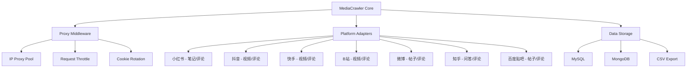
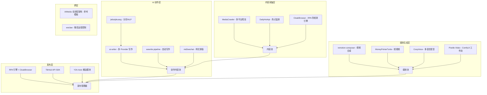

# 补充分析：GitHub Star 项目复用评估报告（第二批）

> 生成日期：2026-07-16  
> 分析方法：github-project-analysis skill v2.0（需求驱动 + URL 驱动混合模式）  
> 分析上下文：Multi-Publish（PROJECT-003）— Electron + Vue 3 + Python FastAPI + RPA 多平台发布桌面应用  
> 基于已 Star 项目清单（131 个中筛选 14 个高价值未分析项）  
> 质量节拍：Phase 1（调研）→ Phase 2（规划）→ Phase 4（复盘输出）

---

## 一、复选速评矩阵

| 优先级 | 项目 | ⭐ | 语言 | 许可证 | 核心价值 |
|:------:|------|:--:|------|--------|---------|
| 🅿️0 | **MediaCrawler** | 56,697 | Python | 自定义 | 多平台爬虫（小红书/抖音/快手/B站/微博/知乎） |
| 🅿️0 | **CloakBrowser** | 28,420 | Python | MIT | Stealth Chromium，防检测 RPA 浏览器 |
| 🅿️1 | **MoneyPrinterTurbo** | 97,796 | Python | MIT | 全自动短视频生成（97K⭐ 行业标杆） |
| 🅿️1 | **Pixelle-Video** | 25,605 | Python | Apache-2.0 | AI 全自动短视频引擎 |
| 🅿️1 | **md2wechat-skill** | 3,260 | Go | 自定义 | Markdown→公众号排版发布 |
| 🅿️1 | **wewrite** | 2,834 | Python | MIT | 公众号全流程 Skill（热点→创作→发布） |
| 🅿️1 | **AIMedia** | 2,365 | Python | Apache-2.0 | 热点抓取+AI创作+自动发布 |
| 🅿️1 | **CosyVoice** | 22,213 | Python | Apache-2.0 | 多语言语音生成 |
| 🅿️2 | **DailyHotApi** | 3,934 | TS | MIT | 热榜聚合 API |
| 🅿️2 | **jieba** | 35,066 | Python | MIT | 中文分词 |
| 🅿️2 | **pkuseg** | 6,710 | Python | MIT | 多领域中文分词 |
| 🅿️2 | **weclaw** | 1,584 | Go | MIT | 微信 Agent 桥接 |
| 🅿️3 | **MediaTrace** | 18 | TS | MIT | 社交媒体爬虫工具（小项目参考） |
| 🅿️3 | **newsnow** | 21,017 | - | - | 实时热点（访问受限） |

---

## 二、逐项目深度分析

---

### 🅿️0-1：NanmiCoder/MediaCrawler（56,697⭐）

**链接**：https://github.com/NanmiCoder/MediaCrawler  
**语言**：Python | **许可证**：自定义（需确认）

#### 技术架构



#### 核心能力

| 能力 | 说明 | 对 Multi-Publish 的价值 |
|------|------|------------------------|
| **跨平台爬虫** | 小红书/抖音/快手/B站/微博/知乎/百度贴吧 | ⭐⭐⭐⭐⭐ 内容采集源头 |
| **评论爬取** | 各平台评论数据 | 内容互动分析 |
| **代理中间件** | IP 代理 + Cookie 轮换 + 限流 | 可注入到 RPA 流程 |
| **异步架构** | asyncio + httpx 高性能爬取 | Python 后端可直接复用 |
| **存储适配** | MySQL/MongoDB/CSV 多种输出 | 灵活的数据管道 |

#### 与 Multi-Publish 的集成分析

| Multi-Publish 模块 | 集成方式 | 工作量 |
|-------------------|---------|:------:|
| `python-backend/` | 直接安装 MediaCrawler 作为依赖 | 1 天 |
| **内容采集管线** | 新增采集管线：监测→爬取→格式化→写入发布队列 | 3 天 |
| **热点追踪** | 利用爬虫监控各平台热门内容，自动选题 | 2 天 |
| **数据回传** | 发布后爬取评论数据，做效果分析 | 2 天 |

**注意**：许可证非标准 MIT/Apache，需确认是否允许商业使用。

---

### 🅿️0-2：CloakHQ/CloakBrowser（28,420⭐）

**链接**：https://github.com/CloakHQ/CloakBrowser  
**语言**：Python | **许可证**：MIT

#### 技术架构

CloakBrowser 是"隐身 Chromium"——通过源码级别的指纹补丁绕过所有机器人检测。

```
CloakBrowser/         （Python 项目）
├── cloak/            # 核心库
├── playwright_patch/ # Playwright 替换补丁
├── tests/            # 30/30 检测全通过
└── install.sh        # 一键安装
```

#### 核心能力

| 能力 | 说明 | 对 Multi-Publish 的价值 |
|------|------|------------------------|
| **0 检测通过率** | 30 项检测全过，远超普通 Playwright | ⭐⭐⭐⭐⭐ 解决 RPA 被检测问题 |
| **Drop-in 替换** | 直接替代 Playwright 浏览器实例 | 替换 `rpa-engine` 底层浏览器 |
| **SSL 指纹** | 真实 TLS 指纹 | 解决 Cloudflare 等问题 |
| **Canvas/WebGL** | 真实硬件指纹 | 防止浏览器特征检测 |
| **WebDriver** | 隐藏自动化标记 | 各平台无法检测是机器人 |

#### 与 Multi-Publish 的集成分析

**这是 RPA 引擎的核心痛点解决方案。**

当前 `rpa-engine` 使用标准 Playwright，发布到抖音/小红书等平台时容易被检测为机器人。CloakBrowser 可以直接作为 Playwright 的 drop-in 替代：

```python
# 当前代码（rpa-engine）
from playwright.sync_api import sync_playwright

# 替换后
from cloak.playwright_patch import sync_playwright  # 零代码改动
```

| 集成步骤 | 说明 | 工作量 |
|---------|------|:------:|
| 1. 安装 CloakBrowser | `pip install cloak-browser` | 10 分钟 |
| 2. 替换 import | `rpa-engine` 改引用 CloakBrowser 的 playwright_patch | 30 分钟 |
| 3. 测试所有平台 | 验证 15 个平台的 RPA 发布是否正常 | 2 天 |

---

### 🅿️1-1：harry0703/MoneyPrinterTurbo（97,796⭐）

**链接**：https://github.com/harry0703/MoneyPrinterTurbo  
**语言**：Python | **许可证**：MIT

#### 技术架构

```
MoneyPrinterTurbo/
├── app/                    # Web 应用核心
│   ├── api/                # REST API
│   ├── models/             # 数据模型
│   └── services/           # 业务服务
├── core/                   # 视频生成核心
│   ├── video_generator.py  # 视频合成引擎
│   ├── subtitle_generator.py # 字幕生成
│   ├── audio_generator.py  # 语音合成
│   ├── material/           # 素材匹配
│   └── script/             # 脚本生成
├── webui/                  # Web 界面
└── config/                 # 配置
```

#### 核心能力

- **主题/关键词 → 完整短视频**：脚本生成→素材匹配→语音合成→字幕→渲染
- **多模型支持**：Kimi / OpenAI / Azure 等多种 LLM
- **多 TTS 引擎**：Edge TTS / 火山引擎 TTS 等
- **WebUI + API**：双模式使用
- **97K⭐**：社区验证过的成熟 pipeline

#### 与 Multi-Publish 的集成分析

| Multi-Publish 模块 | 复用方式 | 工作量 |
|-------------------|---------|:------:|
| `story2video-engine` | **直接参考其 pipeline 架构**（script→material→audio→subtitle→video） | 3 天 |
| 视频生成 | 将其 API 集成到 Python 后端，成为视频生成选项 | 2 天 |
| TTS 配音 | 复用其多引擎 TTS 架构 | 1 天 |
| 素材匹配 | 参考其素材搜索和匹配逻辑 | 2 天 |

**注意**：不直接复制代码，参考架构设计思路。已有 `story2video-engine` 可在此基础上增强。

---

### 🅿️1-2：ATH-MaaS/Pixelle-Video（25,605⭐）

**链接**：https://github.com/ATH-MaaS/Pixelle-Video  
**语言**：Python/TypeScript | **许可证**：Apache-2.0

#### 核心能力

AI 全自动短视频引擎，与 MoneyPrinterTurbo 类似但侧重 ComfyUI 工作流集成。

| 能力 | 说明 |
|------|------|
| **ComfyUI 集成** | 节点式视频生成工作流 |
| **图像生成** | SD / DALL-E 等多种引擎 |
| **TTS 语音** | 多引擎语音合成 |
| **视频合成** | FFmpeg + MoviePy |

#### 与 Multi-Publish 的集成分析

| 复用点 | 说明 | 优先级 |
|--------|------|:------:|
| ComfyUI 工作流管理 | 可参考用于 `remotion-composer` 的可视化编排 | 🅿️2 |
| TTS 多引擎架构 | 参考其 TTS 抽象层，集成到视频模块 | 🅿️1 |

Pixelle-Video 的 ComfyUI 集成思路可以用于构建更灵活的视频合成 pipeline。

---

### 🅿️1-3：geekjourneyx/md2wechat-skill（3,260⭐）

**链接**：https://github.com/geekjourneyx/md2wechat-skill  
**语言**：Go | **许可证**：自定义

#### 核心能力

| 功能 | 说明 |
|------|------|
| Markdown → 公众号 | 一键排版发布 |
| 40+ 排版样式 | 专业主题模板 |
| AI 配图 | 自动配图生成 |
| 批量发布 | 多公众号管理 |
| CLI 模式 | Agent 可直接调用 |

#### 与 Multi-Publish 的集成分析

**直接增强 Multi-Publish 的公众号发布能力**。

| Current | 问题 | md2wechat 方案 | 集成方式 |
|---------|------|---------------|---------|
| `rpa-engine` 发布公众号 | 排版效果不一致 | 40+ 专业样式保证效果 | Python 后端调用其 CLI |
| 手动配图 | 效率低 | AI 自动配图 | 集成配图 API |
| 单账号 | 限制 | 多账号管理 | 复用其多账号设计 |

---

### 🅿️1-4：imraywang/wewrite（2,834⭐）

**链接**：https://github.com/imraywang/wewrite  
**语言**：Python | **许可证**：MIT

#### 核心能力

公众号内容全流程 Skill："一句话跑完整条内容管道"。

**pipeline**：热点抓取 → 素材整理 → AI 写作 → 排版 → 发布到微信草稿箱

#### 与 Multi-Publish 的集成分析

| 阶段 | wewrite 能力 | 集成到 Multi-Publish |
|------|-------------|-------------------|
| 热点监测 | 各平台热点抓取 | 可复用其热点源配置 |
| AI 写作 | 根据热点自动创作 | 可注入 `ai-writer` 的 prompt 模板 |
| 排版 | 多样式排版 | 参考其样式引擎 |
| 发布 | 微信公众号草稿箱 | 可替换为 RPA/API 方式 |

**关键价值**：其"一句话全流程"的设计理念正是 Multi-Publish 追求的用户体验。

---

### 🅿️1-5：Anning01/AIMedia（2,365⭐）

**链接**：https://github.com/Anning01/AIMedia  
**语言**：Python | **许可证**：Apache-2.0

#### 核心能力

自动抓取热点 → AI 创作文章 → 自动发布到头条/小红书/公众号。

#### 与 Multi-Publish 的集成分析

| 维度 | AIMedia | Multi-Publish 集成 |
|------|---------|-------------------|
| 热点源 | 各平台热点 | 替换为 DailyHotApi 或 MediaCrawler |
| AI 写作 | prompt 模板 | 注入 `ai-writer` |
| 发布目标 | 头条/小红书/公众号 | 复用 Multi-Publish 已有的发布引擎 |
| 定时发布 | 有 | 已有 `publish-interval-guard` |

**价值**：作为"全流程自动化"的参考实现，其架构设计（监测→创作→发布）正是 Multi-Publish 的目标形态。

---

### 🅿️1-6：FunAudioLLM/CosyVoice（22,213⭐）

**链接**：https://github.com/FunAudioLLM/CosyVoice  
**语言**：Python | **许可证**：Apache-2.0  
**作者**：阿里云通义语音实验室

#### 核心能力

| 能力 | 说明 | 对 Multi-Publish 价值 |
|------|------|---------------------|
| **多语言语音合成** | 中文/英文/粤语/跨语言 | ⭐⭐⭐⭐⭐ 视频配音 |
| **零样本克隆** | 参考音频即可克隆音色 | 个性化配音 |
| **情感控制** | 控制语速/情感/停顿 | 自然配音 |
| **流式推理** | 低延迟输出 | 实时预览 |
| **WebUI** | Gradio 界面 | 便捷使用 |

#### 与 Multi-Publish 的集成分析

| 场景 | 当前方案 | CosyVoice 方案 | 集成方式 |
|------|---------|---------------|---------|
| 视频配音 | 无/Edge-TTS | **多语言 + 音色克隆** | Python 后端调用 CosyVoice API |
| 文章朗读 | 无 | 文字→语音内容消费 | 新增"朗读"功能 |
| 多语言发布 | 无 | 跨语言配音 | 翻译内容后自动配音 |

**集成方式**：
- 本地部署：`pip install cosyvoice`，下载模型（~2GB）
- API 调用：通过阿里云 ModelScope 的在线 API
- 集成到 `remotion-composer` 的 TTS Pipeline

---

### 🅿️2-1：imsyy/DailyHotApi（3,934⭐）

**链接**：https://github.com/imsyy/DailyHotApi  
**语言**：TypeScript | **许可证**：MIT

#### 核心能力

聚合热门数据 API，60+ 站点热榜接口。

| 站点 | 接口 |
|------|------|
| B站 | 热门榜/每周必看 |
| 微博 | 热搜榜/文娱榜 |
| 知乎 | 热榜/日报 |
| 百度 | 热搜榜 |
| 抖音 | 热点榜 |
| 快手 | 热点榜 |
| 头条 | 热榜 |
| 百度贴吧 | 热议榜 |

#### 与 Multi-Publish 的集成分析

作为内容采集模块的前置热点源：

| 集成方式 | 说明 | 工作量 |
|---------|------|:------:|
| 直接部署 Vercel/本地 | `node app.js` 即可运行 | 10 分钟 |
| 集成到 `python-backend` | 定期拉取热点，自动选题 | 1 天 |
| 与 AI Writer 联动 | 热点→自动创作→发布 | 1 天 |

---

### 🅿️2-2：fxsjy/jieba（35,066⭐）& lancopku/pkuseg（6,710⭐）

**链接**：https://github.com/fxsjy/jieba / https://github.com/lancopku/pkuseg-python  
**许可证**：MIT

#### 与 Multi-Publish 的集成分析

| 应用场景 | 使用方式 | 优先级 |
|---------|---------|:------:|
| **内容质量检测** | 分词→计算词汇量/可读性/关键词密度 | 🅿️2 |
| **标题优化** | 提取关键词→评估标题吸引力 | 🅿️2 |
| **敏感词检测** | 结合敏感词库做内容审核 | 🅿️1 |
| **标签自动生成** | 提取文章关键词作为发布标签 | 🅿️1 |
| **内容去重** | 计算文本相似度 | 🅿️2 |

**建议**：jieba 成熟稳定（35066⭐），推荐作为主要分词引擎。pkuseg 在多领域分词精度更高，可用于专业领域内容。

---

### 🅿️2-3：fastclaw-ai/weclaw（1,584⭐）

**链接**：https://github.com/fastclaw-ai/weclaw  
**语言**：Go | **许可证**：MIT

#### 核心能力

微信 ↔ AI Agent 桥接工具。支持通过微信聊天直接调用 AI Agent。

#### 与 Multi-Publish 的集成分析

| 场景 | 价值 | 集成方式 |
|------|------|---------|
| 微信远程管理发布 | 用微信指令触发发布任务 | 🅿️3（长期） |
| Agent 通知 | 发布完成推送到微信 | 🅿️3 |

**适合长期规划**，短期不优先。

---

## 三、交叉对比：与已分析 10 项目的融合

### 完整技术栈蓝图



---

## 四、综合实施路线图（更新版）

整合第一批（10 项目）和第二批（14 项目）分析结果：

### 第一阶段 — Core Publishing API 增强（P0，1-2 周）

| # | 任务 | 依赖项目 | 工作量 |
|---|------|---------|:------:|
| 1 | 集成 TikHub SDK，API 替代 RPA 发布（抖音/小红书/微博） | TikHub-API-Python-SDK | 3d |
| 2 | 替换 RPA 引擎为 CloakBrowser 防检测浏览器 | CloakBrowser | 2d |
| 3 | 集成 MediaCrawler 作为内容采集源 | MediaCrawler | 3d |

### 第二阶段 — 短视频 + 媒体能力（P1，3-5 周）

| # | 任务 | 依赖项目 | 工作量 |
|---|------|---------|:------:|
| 4 | 升级 Remotion 集成 + 动态封面图 | remotion-dev/remotion | 2d |
| 5 | 集成 MoneyPrinterTurbo 的短视频 pipeline | MoneyPrinterTurbo | 3d |
| 6 | 集成 CosyVoice 多语言 TTS 配音 | CosyVoice | 2d |
| 7 | 集成 md2wechat 公众号排版发布 | md2wechat-skill | 2d |
| 8 | 集成 wewrite 全流程写作 pipeline | wewrite | 2d |
| 9 | 集成 DailyHotApi 热点监测 | DailyHotApi | 1d |

### 第三阶段 — NLP + 内容质量（P2，5-7 周）

| # | 任务 | 依赖项目 | 工作量 |
|---|------|---------|:------:|
| 10 | 集成 jieba 分词做标签/关键词自动生成 | jieba | 1d |
| 11 | 集成 pkuseg 做多领域内容分类 | pkuseg-python | 1d |
| 12 | 参考 AIMedia 架构优化全流程编排 | AIMedia | 2d |
| 13 | Y2A-Auto YouTube→B站翻译搬运模块 | Y2A-Auto | 3d |

---

## 五、许可证合规矩阵

| 项目 | 许可证 | 使用限制 |
|------|--------|---------|
| MediaCrawler | 自定义 | ⚠️ 需确认商业使用条款 |
| CloakBrowser | MIT | ✅ 无限制 |
| MoneyPrinterTurbo | MIT | ✅ 无限制 |
| Pixelle-Video | Apache-2.0 | ✅ 商业友好 |
| md2wechat-skill | 自定义 | ⚠️ 需确认 |
| wewrite | MIT | ✅ 无限制 |
| AIMedia | Apache-2.0 | ✅ 商业友好 |
| CosyVoice | Apache-2.0 | ✅ 商业友好（模型需遵循模型协议） |
| DailyHotApi | MIT | ✅ 无限制 |
| jieba | MIT | ✅ 无限制 |
| pkuseg | MIT | ✅ 无限制 |
| weclaw | MIT | ✅ 无限制 |

---

## 六、总结

### 本次补充分析的 14 个项目中，最高价值集成：

| 排名 | 项目 | 价值 | 为什么 |
|:----:|------|:----:|--------|
| 🥇 | **MediaCrawler** (56K⭐) | **内容采集** | 补全 Multi-Publish 的"内容源"缺口——现在只能手动写内容，有了爬虫可以自动采集各平台内容 |
| 🥇 | **CloakBrowser** (28K⭐) | **RPA 防检测** | 解决 RPA 发布被平台检测的核心痛点，drop-in 替换无需改代码 |
| 🥉 | **MoneyPrinterTurbo** (97K⭐) | **短视频生成** | 行业标杆方案，直接参考其 script→material→audio→subtitle→video pipeline |
| 4 | **CosyVoice** (22K⭐) | **多语言 TTS** | 补齐多语言配音能力 |
| 5 | **md2wechat + wewrite** | **公众号全流程** | 补齐公众号发布的排版和专业度 |

### 架构演进路径

```
当前：手动采集 → AI写作 → RPA发布

第一阶段：MediaCrawler自动采集 → AI写作 → TikHub API + CloakBrowser RPA 发布
         ↑ DailyHotApi 热点       ↑ jieba/pkuseg NLP

第二阶段：↑ + MoneyPrinterTurbo/Pixelle 视频 + CosyVoice 配音 → 全媒体发布

第三阶段：↑ + AIMedia 全流程自动化 + md2wechat/wewrite 深度集成
```

报告保存路径：与第一批分析报告合并参考。

